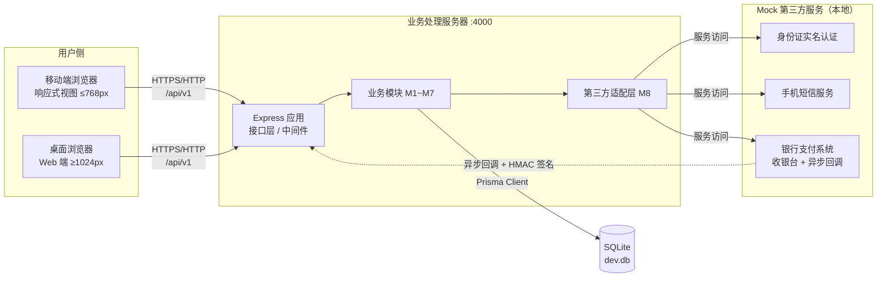
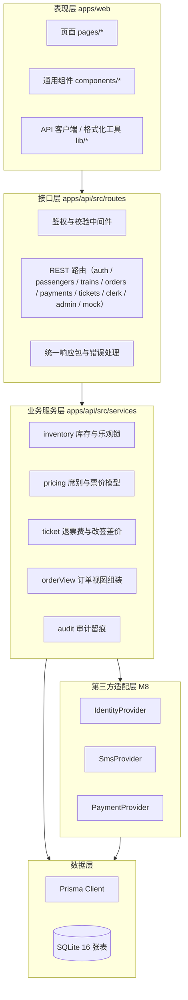

# 04 · 系统架构设计说明书（DOC-04）

| 项 | 内容 |
| --- | --- |
| 文档编号 | DOC-04 |
| 版本 | v1.0 |
| 状态 | 已定稿 |
| 编写人 | 【待填】 |
| 评审人 | 【待填】 |
| 更新日期 | 【待填】 |
| 关联文档 | DOC-01 项目基线与实现计划、DOC-07 UI 原型与设计说明 |

---

## 1. 设计目标与原则

| 原则 | 落地方式 |
| --- | --- |
| **与需求原文部署图一致** | 需求原文给出的 4 类节点（移动端 / Web 端 / 业务处理服务器 / 数据库）与 3 类第三方服务，在架构中一一对应，见 §2 |
| **分层解耦、职责单一** | 表现层 / 接口层 / 服务层 / 数据层 + 独立的第三方适配层，模块间只通过函数与接口调用 |
| **契约先行** | 前后端以统一的 `{code,message,data,requestId}` 响应包与 REST 资源路径为契约，前端不感知数据库结构 |
| **资金与库存安全优先** | 库存扣减、支付结算、退改差价全部走数据库事务 + 乐观锁，全部关键接口幂等 |
| **可本地一键运行** | SQLite 单文件库、Mock 三方服务内置、`npm run setup && npm run dev` 即可完整演示 |
| **零真实外部依赖** | 不接真实实名/短信/支付接口，但适配层接口与真实服务同构，可配置切换 |

---

## 2. 部署架构（与需求原文对照）

### 2.1 需求原文部署图的落地

```
<<Node>> 移动端                      <<Node>> 业务处理服务器              <<Node>> 身份证认证
 Mini-12306 App        ╲            业务处理构件                        <<Node>> 银行和支付系统
 移动运行环境           ╲  (HTTPS)  后端服务器运行环境   ──(服务访问)──▶  <<Node>> 手机运营服务系统
                        ╲                    │
<<Node>> Web 端          ╱                    │ (JDBC / 数据访问)
 Web 浏览器及页面        ╱                     ▼
 个人计算机运行环境     ╱              <<Node>> 数据库系统
```

**本项目实现映射**（保持语义一致，技术选型现代化）：

| 部署图节点 | 原文构件 | 本项目实现 | 说明 |
| --- | --- | --- | --- |
| 移动端 | `Mini-12306 App` + 移动运行环境 | `apps/web` 的**移动端响应式视图**（≤768px 断点 + 底部导航） | 以响应式 Web 承载 App 形态，避免原生打包成本 |
| Web 端 | 浏览器 + Mini-12306 页面 + 个人计算机运行环境 | `apps/web` 的**桌面端视图**（≥1024px）；售票窗口与管理后台仅桌面端开放 | 同一套前端代码，按角色渲染不同视图 |
| 业务处理服务器 | 业务处理构件 + 后端服务器运行环境 | `apps/api`（Node.js + Express + TypeScript），端口 **4000** | 单体分层架构，内含 8 个业务模块 |
| 数据库系统 | 数据库（JDBC 连接） | **SQLite**（`apps/api/prisma/dev.db`），经 Prisma Client 访问 | 单文件、零安装，对应"数据访问"语义 |
| 身份证认证 | 服务访问 | `MockIdentityProvider`（`identityProvider.verify`） | 身份证校验位算法 + 风控名单模拟 |
| 银行和支付系统 | 服务访问 | `MockPaymentProvider`（收银台页面 + HMAC 签名异步回调） | 完整模拟"创建支付单 → 收银台 → 异步回调 → 验签 → 结算"链路 |
| 手机运营服务系统 | 服务访问 | `MockSmsProvider`（`smsProvider.send`） | 验证码写入数据库，Mock 通道直接回传便于演示 |

### 2.2 运行时部署图



**图 4-1 Mini-12306 运行时部署图**

---

## 3. 逻辑架构

### 3.1 分层结构



**图 4-2 分层架构图**

### 3.2 模块划分（8 大模块）

| 模块 | 代码位置 | 职责 | 对外接口 |
| --- | --- | --- | --- |
| M1 用户与认证 | `routes/auth.ts`、`middleware/auth.ts` | 注册、登录、会话、资料、乘车人 | `/auth/*`、`/passengers/*` |
| M2 实名认证 | `routes/auth.ts`、`lib/idcard.ts` | 实名核验、证件加密与脱敏 | `/mock/identity/verify` |
| M3 车次查询 | `routes/trains.ts` | 车站、车次检索、运行日、余票票价、公告 | `/stations`、`/trains/*`、`/announcements` |
| M4 订单与购票 | `routes/orders.ts`、`services/inventory.ts` | 下单锁票、订单查询、取消、超时释放 | `/orders/*` |
| M5 支付 | `routes/payments.ts`、`providers/mock.ts` | 支付单、收银台、回调验签、结算、退款 | `/orders/:no/pay`、`/payments/*` |
| M6 退票与改签 | `routes/tickets.ts`、`services/ticket.ts` | 退票费试算与核收、改签差价收退 | `/refunds/*`、`/changes/*` |
| M7 系统设置与运营 | `routes/admin.ts`、`routes/clerk.ts` | 车站/车次/运行日/库存/公告/用户/参数/审计/统计、售票窗口 | `/admin/*`、`/clerk/*` |
| M8 基础服务适配 | `providers/*` | 三类第三方能力的统一接口 + Mock 实现 + 留痕 | 内部调用 + `/mock/*` 对外暴露 |

---

## 4. 数据架构

- **存储**：单库 SQLite，16 张表（用户、乘车人、车站、车次、运行日、席别库存、订单、车票、支付流水、退票、改签、验证码、实名核验留痕、公告、系统参数、审计日志）。
- **一致性核心**：`seat_inventory` 表以 `total_count / sold_count / locked_count / version` 四列表达库存状态；
  - 余票 = `total_count − sold_count − locked_count`
  - 下单：`locked_count += n`（乐观锁 `version` 条件更新）
  - 支付成功：`locked_count -= n; sold_count += n`
  - 取消/超时：`locked_count -= n`
  - 退票：`sold_count -= n`
- **金额**：一律以**分**为单位的整数存储与计算，杜绝浮点误差。
- **敏感数据**：身份证号以 AES-256-GCM 加密存储（`idCardCipher`），同时保存确定性 HMAC 摘要（`idCardHash`）用于唯一性校验与按证件检索；界面与日志只出现脱敏串 `110***********1234`。
- 表结构详细设计见 DOC-05（实验三产出）。

---

## 5. 开发架构

```
软件工程基础实验/
├─ apps/
│  ├─ api/                     后端（Node.js + Express + TypeScript + Prisma）
│  │  ├─ prisma/schema.prisma  16 张表的数据模型（schema 即文档）
│  │  ├─ prisma/seed.ts        初始化数据（16 车站 / 22 车次 / 14 天运行日 / 演示账号）
│  │  ├─ scripts/smoke.mjs     端到端冒烟测试（51 项断言）
│  │  └─ src/
│  │     ├─ index.ts           应用装配：中间件 → 路由 → 静态资源 → 定时任务
│  │     ├─ config.ts          配置与系统参数默认值
│  │     ├─ db.ts              Prisma 客户端与参数读取
│  │     ├─ middleware/auth.ts JWT 会话与 RBAC
│  │     ├─ lib/               响应包、加密、证件校验、时间、单号
│  │     ├─ providers/         第三方适配层（接口 + Mock 实现）
│  │     ├─ services/          库存、票价、退改规则、订单视图、审计
│  │     └─ routes/            9 个路由模块
│  └─ web/                     前端（React + Vite + Tailwind）
│     └─ src/
│        ├─ main.tsx / App.tsx 入口与路由表（含登录与角色守卫）
│        ├─ lib/               API 客户端、鉴权上下文、格式化
│        ├─ components/        布局与通用组件
│        └─ pages/             旅客端 12 页 + 售票窗口 1 页 + 管理后台 9 页
├─ docs/                       项目文档
└─ README.md
```

**构建与运行**

| 命令 | 作用 |
| --- | --- |
| `npm run setup` | 安装依赖 + 建库 + 灌初始化数据 |
| `npm run dev` | 同时启动后端（:4000）与前端（:5173） |
| `npm run dev:api` / `npm run dev:web` | 单独启动某一端 |
| `npm run build` | 构建前端产物（构建后可由后端单端口托管） |
| `npm run db:reset` | 重建数据库并重新灌数据 |

---

## 6. 关键机制设计

### 6.1 统一响应与错误处理

所有接口返回 `{ code, message, data, requestId }`；`code = 0` 表示成功。业务异常统一抛 `ApiError(code, message, httpStatus)`，由 `errorHandler` 中间件转换；未捕获异常返回 `9000`，**不向前端泄露堆栈**。

错误码分段：`1xxx` 通用/参数、`2xxx` 账号与实名、`3xxx` 车次与售票时间、`4xxx` 库存与订单、`5xxx` 订单状态、`6xxx` 退改规则、`7xxx` 第三方服务、`9xxx` 系统。

### 6.2 认证与授权

- 登录成功签发 JWT（有效期 12h），载荷含 `id / username / role`；
- `requireAuth` 中间件校验令牌并回查用户状态，**被冻结账号立即失效**；
- `requireRole('ADMIN')` / `requireRole('CLERK','ADMIN')` 做角色校验，越权返回 `1003`；
- 售票窗口与管理端各自挂载独立前缀（`/api/v1/clerk`、`/api/v1/admin`），避免路由级守卫误拦截其它请求。

### 6.3 防超卖（核心）

```ts
// services/inventory.ts —— 事务内「先判定余票，再以乐观锁条件更新」
const inv = await tx.seatInventory.findFirst({ where: { scheduleId, seatClass } });
if (availableOf(inv) < count) throw new ApiError(4001, `余票不足，当前仅剩 ${available} 张`, 409);
const updated = await tx.seatInventory.updateMany({
  where: { id: inv.id, version: inv.version },   // ← 版本未变才允许写入
  data: { lockedCount: { increment: count }, version: { increment: 1 } },
});
if (updated.count === 0) throw Errors.conflict('库存并发冲突，请重新提交');  // code 4002
```

**实测结论**：把某席别定员压到只剩 3 张后发起 **8 个并发下单**，结果恰好 3 笔成功、5 笔被拒绝，`sold_count + locked_count ≤ total_count` 始终成立——**零超卖**（见冒烟测试第 12 项）。

### 6.4 幂等

| 场景 | 实现 |
| --- | --- |
| 下单 | 请求头 `Idempotency-Key` 落到 `orders.idempotency_key` 唯一列，重复提交直接返回首次订单 |
| 支付回调 | 以 `out_trade_no` 定位支付单，`status = SUCCESS` 时直接返回"已幂等处理" |
| 退票 | 以车票状态机守护（仅 `TICKETED` 可退），重复提交被状态校验拒绝 |

### 6.5 订单超时释放

**双保险**：① 惰性检查——查询订单或发起支付时若 `expire_at < now` 就地置为 `EXPIRED` 并释放锁票；② 定时任务——服务启动后每 60 秒扫描 `PENDING_PAYMENT` 且已过期的订单批量释放（`routes/orders.ts → expireOutdatedOrders`），管理端也提供手动触发入口。

### 6.6 第三方适配层（M8）

```
IdentityProvider  ← MockIdentityProvider   （身份证校验位 + 风控名单 + 银行卡 Luhn 四要素）
SmsProvider       ← MockSmsProvider        （验证码入库 + 控制台输出 + 接口回传）
PaymentProvider   ← MockPaymentProvider    （创建支付单 / 收银台 / 查单 / 退款 / HMAC 验签）
```

- 切换方式：`.env` 中 `PROVIDER_MODE=mock|real`，业务代码只依赖接口，**不感知实现**；
- 支付回调真实走通了完整链路：收银台按钮 → Mock 银行构造 payload → `HMAC-SHA256` 签名 → 回调 `/payments/callback` → 服务端验签 → 结算出票；签名错误返回 `7002`；
- 每次核验写入 `identity_verifications`（provider、请求 ID、结果、耗时），满足 FR-04/FR-24 的留痕要求。

### 6.7 审计

管理员的写操作（车次/库存/公告/用户/参数/窗口收银）统一调用 `writeAudit()` 落 `audit_logs`，记录操作人、角色、动作、目标、详情 JSON、IP；审计失败不阻断主流程。

### 6.8 车站解析与城市级检索

车次查询的入口是「出发站 + 到达站」，而用户可能输入**站名**（北京南）、**城市名**（北京）、**拼音**（beijingnan）或**电报码**（VNP）。解析规则：

| 优先级 | 匹配方式 | 结果 |
| :--: | --- | --- |
| 1 | 站名精确匹配，且站名 ≠ 城市名（如「北京南」） | 单个车站 |
| 2 | 站名精确匹配，且站名 = 城市名（如「上海」） | **按城市处理**，展开为同城全部车站（上海虹桥、上海） |
| 3 | 电报码精确匹配（如 `SHH`） | 单个车站 |
| 4 | 城市名匹配（如「北京」） | 展开为同城全部车站（北京南、北京西） |
| 5 | 站名模糊包含（如「京」） | 所有命中的车站 |

- 解析结果是一个**车站集合** `{ ids, label, city, isCity, names }`，查询条件写作 `fromStationId: { in: ids }`；
- 前端**不做过早收敛**：把用户的原始输入交给后端解析，避免"北京"被前端硬选成北京南后导致「北京 → 上海」查不到车；
- 若两个集合存在交集（如「北京 → 北京」），返回 `1001 出发站与到达站不能相同`。

> 该设计直接对应真实 12306 的"按城市查车"体验，也是本项目在可用性上的一处刻意打磨。

---

## 7. 技术选型与论证

| 层 | 选型 | 备选 | 选定理由 |
| --- | --- | --- | --- |
| 前端框架 | React 18 + TS + Vite | Vue3 + Element Plus | 组件化与类型体验好、Vite 冷启动快、团队更熟悉；组件全部手写，无重型依赖 |
| 样式 | Tailwind CSS | Ant Design | 原子化类名便于把设计 token 直接落到代码，无需覆盖组件库默认样式 |
| 后端 | Node.js + Express + TS | Spring Boot + MySQL | 与前端同语言，2 人组上下文切换成本最低；Express 中间件模型直观，便于讲清分层 |
| ORM | Prisma | 手写 SQL | `schema.prisma` 即数据字典，迁移与类型生成自动化，便于文档与代码同步 |
| 数据库 | SQLite | MySQL / PostgreSQL | 零安装、单文件、可随项目提交；事务与乐观锁能力足以支撑本项目的并发场景 |
| 第三方 | 适配层 + Mock | 真实对接 | 课程环境无法申请真实资质；Mock 契约与真实服务同构，可一键切换，且能完整演示回调与验签 |
| 测试 | 端到端冒烟脚本（Node fetch） | Jest + Supertest | 一个 51 项断言的脚本即可覆盖 14 组业务场景，成本最低、演示效果最好 |

---

## 8. 架构决策记录（ADR）

| 编号 | 决策 | 理由 | 代价 / 权衡 |
| --- | --- | --- | --- |
| ADR-001 | 采用单体分层架构而非微服务 | 2 人组、8 周、课程演示；微服务的运维与调试成本远超收益 | 无法演示服务治理能力，在文档中说明 |
| ADR-002 | 第三方服务用适配层 + Mock 实现 | 无真实资质；且能完整演示回调链路与失败分支 | 需自行设计契约，已在 DOC 中固化 |
| ADR-003 | 库存扣减用乐观锁 + 条件更新，而非悲观锁 | SQLite 写锁粒度大，悲观锁易阻塞；乐观锁逻辑清晰、可演示冲突重试 | 高冲突场景需重试，已限制重试次数并返回明确错误码 |
| ADR-004 | 金额一律用「分」的整数 | 浮点数在乘除折扣时会产生误差，资金场景不可接受 | 展示层需统一兑换，已封装 `yuan()/money()` |
| ADR-005 | 身份证号加密存储 + HMAC 摘要双列 | 加密列不可检索；摘要列支撑唯一性校验与按证件检索 | 摘要列需防字典攻击，使用密钥化 HMAC 而非裸哈希 |
| ADR-006 | 订单超时用「惰性检查 + 定时任务」双保险 | 纯定时任务有最长 60 秒延迟；纯惰性检查在无人访问时不释放库存 | 逻辑两处需保持一致，已抽成同一个 `expireOrder()` |
| ADR-007 | 移动端以响应式 Web 承载，不做原生 App | 部署图要求"移动端"形态；原生打包对课程目标无增量价值 | 无法演示推送等原生能力，已在范围说明中标注 |
| ADR-008 | 改签差价即时结算（不经二次支付流程） | 简化实现又不丢业务规则：差价、退差手续费、改签次数限制全部保留 | 与真实 12306 的"先支付后生效"有差异，已在文档中标注为简化 |

---

## 9. 与需求 / 非功能需求的对应

| 需求 | 架构支撑 |
| --- | --- |
| FR-01~FR-04 注册与实名 | M1/M2 模块 + `identityProvider` 适配 + AES 加密与脱敏 |
| FR-05~FR-07 查询与变动 | M3 模块 + `train_schedules.status` 状态 + 公告联动 |
| FR-08~FR-12 购票与支付 | M4/M5 模块 + 乐观锁库存 + Mock 银行回调验签 + 幂等 |
| FR-13~FR-14 退票改签 | M6 模块 + `services/ticket.ts` 阶梯费率与差价模型 + 状态机守护 |
| FR-15~FR-23 运营与窗口 | M7 模块 + RBAC + 审计留痕 |
| FR-19/FR-24 适配与留痕 | M8 模块 + `identity_verifications` 记录 |
| NFR-02 并发零超卖 | §6.3 乐观锁方案，已由并发测试验证 |
| NFR-04 事务一致性 | 库存/订单/支付三者同事务或补偿回滚（退票失败时回滚库存与票状态） |
| NFR-06~NFR-09 安全 | bcrypt 加盐、AES-GCM 加密、JWT + RBAC、Zod 入参校验、统一错误码不泄露堆栈 |
| NFR-12 兼容性 | 响应式断点 360/768/1024/1440，桌面端与移动端两套导航 |
| NFR-15 一键启动 | `npm run setup && npm run dev`，SQLite 与 Mock 服务均无外部依赖 |

---

## 10. 架构评审记录

| 评审项 | 结论 | 意见 |
| --- | --- | --- |
| 是否与需求原文部署图一致 | 通过 | 4 类节点与 3 类第三方服务全部落地，差异点在 §2.1 逐条说明 |
| 分层与模块职责是否清晰 | 通过 | 8 模块边界明确，服务层不依赖 Express 上下文 |
| 资金与库存安全设计是否充分 | 通过 | 事务 + 乐观锁 + 幂等 + 审计，并有并发测试证据 |
| 是否存在过度设计 | 通过 | 未引入微服务、消息队列、缓存中间件 |
| 评审人签字 | 【待填】 | |
