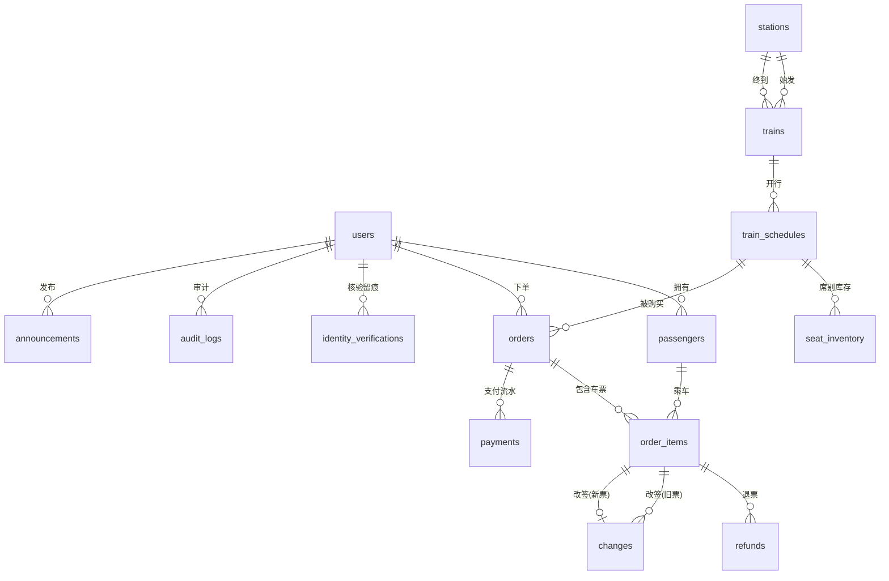

# 05 · 数据库设计说明书（DOC-05）

| 项 | 内容 |
| --- | --- |
| 文档编号 | DOC-05 |
| 版本 | v1.0 |
| 状态 | 已定稿 |
| 编写人 | 【待填】 |
| 评审人 | 【待填】 |
| 更新日期 | 【待填】 |
| 关联文档 | DOC-04 系统架构设计说明书、DOC-01 项目基线与实现计划 |
| 权威来源 | `apps/api/prisma/schema.prisma`（schema 与本文档必须保持一致，改表必须同步改文） |

---

## 1. 设计约定

| 约定 | 说明 |
| --- | --- |
| 数据库 | SQLite 3（单文件 `apps/api/prisma/dev.db`），通过 Prisma Client 访问 |
| 表名 | 模型名 PascalCase，落库映射为 `snake_case` 复数（如 `Order` → `orders`） |
| 主键 | 统一自增整数 `id` |
| 外键 | `<实体单数>_id`，如 `order_id`、`passenger_id` |
| 金额 | 一律以**分**为单位的整数，字段后缀 `_cents`；**禁止浮点** |
| 时间 | `DateTime` 存 UTC 瞬间，展示层统一按东八区（+08:00）格式化 |
| 枚举 | SQLite 不支持 Prisma enum，一律用 `String` 存储，取值在 §4 冻结 |
| 软删除 | 需要保留历史的表使用 `is_deleted`（乘车人）或状态字段（车票、公告） |
| 敏感字段 | 证件号 `id_card_cipher`（AES-256-GCM 密文）+ `id_card_hash`（HMAC-SHA256 摘要，用于唯一性与检索）+ `id_card_suffix`（后 4 位，用于展示） |

---

## 2. 概念模型（实体关系图）

**图 5-1 实体关系图（ER）**

**关系说明**

| 关系 | 基数 | 说明 |
| --- | --- | --- |
| 用户 — 乘车人 | 1 : N | 每账号最多 10 名乘车人（软删保留历史） |
| 用户 — 订单 | 1 : N | 一个账号可有多笔订单 |
| 车次 — 运行日 | 1 : N | 同一车次每个运行日一条记录，`(train_id, run_date)` 唯一 |
| 运行日 — 席别库存 | 1 : N | 每个运行日按席别（商务/一等/二等/无座 或 软卧/硬卧/硬座）各一条 |
| 订单 — 车票 | 1 : N | 一单最多 5 张票，退改以车票为最小粒度 |
| 订单 — 支付流水 | 1 : N | 一次支付尝试一条；退款与改签差价另生成流水 |
| 车票 — 退票 / 改签 | 1 : N | 一张票可多次申请退票（仅一次成功）；改签限一次 |

---

## 3. 物理模型（表结构）

### 3.1 `users` 用户账号

| 字段 | 类型 | 约束 | 说明 |
| --- | --- | --- | --- |
| id | Int | PK, 自增 | |
| username | String | 唯一 | 登录名，4~20 位字母数字下划线 |
| password_hash | String | 非空 | bcrypt(cost=10) 哈希 |
| real_name | String | 非空 | 真实姓名 |
| id_card_cipher | String | 非空 | 证件号 AES-256-GCM 密文（base64: iv+tag+密文） |
| id_card_hash | String | 唯一 | 证件号 HMAC-SHA256 摘要，用于唯一性校验与按证件检索 |
| id_card_suffix | String | 非空 | 证件号后 4 位，用于展示与模糊检索 |
| phone | String | 唯一 | 11 位手机号 |
| bank_card_last4 | String? | 可空 | 银行卡后 4 位（不存完整卡号） |
| role | String | 默认 `PASSENGER` | `PASSENGER` / `CLERK` / `ADMIN` |
| status | String | 默认 `ACTIVE` | `ACTIVE` / `FROZEN` |
| is_verified | Boolean | 默认 false | 是否已通过实名核验 |
| login_fail_count | Int | 默认 0 | 连续登录失败次数 |
| locked_until | DateTime? | 可空 | 账号锁定到期时间 |
| last_login_at | DateTime? | 可空 | 最后登录时间 |
| created_at / updated_at | DateTime | | 创建 / 更新时间 |

### 3.2 `passengers` 乘车人档案

| 字段 | 类型 | 约束 | 说明 |
| --- | --- | --- | --- |
| id | Int | PK | |
| user_id | Int | FK → users.id, 索引 | 归属账号 |
| name | String | 非空 | 乘车人姓名 |
| id_card_cipher / id_card_hash / id_card_suffix | String | | 证件号密文 / 摘要 / 后 4 位 |
| phone | String? | 可空 | 联系手机号 |
| passenger_type | String | 默认 `ADULT` | `ADULT` / `CHILD` / `STUDENT` |
| is_default | Boolean | 默认 false | 是否默认乘车人 |
| is_deleted | Boolean | 默认 false | 软删除标记 |
| created_at | DateTime | | |

### 3.3 `stations` 车站

| 字段 | 类型 | 约束 | 说明 |
| --- | --- | --- | --- |
| id | Int | PK | |
| code | String | 唯一 | 电报码（如 `VNP` = 北京南） |
| name | String | 非空 | 站名 |
| city / province | String | 非空 | 所属城市 / 省份 |
| pinyin | String | 非空 | 拼音，用于搜索 |
| is_active | Boolean | 默认 true | 是否启用 |

### 3.4 `trains` 车次

| 字段 | 类型 | 约束 | 说明 |
| --- | --- | --- | --- |
| id | Int | PK | |
| train_no | String | 唯一 | 车次号，如 `G101`（不含日期） |
| train_type | String | 非空 | `G`/`D`/`T`/`K`/`Z`，决定发售席别 |
| from_station_id / to_station_id | Int | FK → stations.id | 始发 / 终到站，二者不可相同 |
| depart_time / arrive_time | String | 非空 | 固定发车/到达时刻 `HH:mm` |
| duration_min | Int | 非空 | 历时（分钟） |
| mileage_km | Int | 非空 | 里程，参与票价里程系数 |
| base_price_cents | Int | 非空 | 基准价（二等座/硬座口径，单位分） |
| is_active | Boolean | 默认 true | 是否在售 |

### 3.5 `train_schedules` 运行日

| 字段 | 类型 | 约束 | 说明 |
| --- | --- | --- | --- |
| id | Int | PK | |
| train_id | Int | FK → trains.id | |
| run_date | String | `yyyy-MM-dd`，与 train_id 组合唯一，索引 | 运行日期（东八区） |
| status | String | 默认 `NORMAL` | `NORMAL` / `DELAYED` / `CANCELLED` |
| delay_minutes | Int | 默认 0 | 晚点分钟数 |
| note | String? | 可空 | 备注（如晚点原因） |
| created_at | DateTime | | |

### 3.6 `seat_inventory` 席别库存与票价（**并发核心表**）

| 字段 | 类型 | 约束 | 说明 |
| --- | --- | --- | --- |
| id | Int | PK | |
| schedule_id | Int | FK → train_schedules.id，与 seat_class 组合唯一 | |
| seat_class | String | 非空 | `BUSINESS`/`FIRST`/`SECOND`/`SOFT_SLEEPER`/`HARD_SLEEPER`/`HARD_SEAT`/`STANDING` |
| price_cents | Int | 非空 | 该席别成人票价（分） |
| total_count | Int | 非空 | 定员（总可售张数） |
| sold_count | Int | 默认 0 | 已售张数 |
| locked_count | Int | 默认 0 | 已锁定（下单未支付）张数 |
| version | Int | 默认 0 | **乐观锁版本号** |

> **余票公式**：`available = total_count − sold_count − locked_count`
> **不变量**：任何时刻必须满足 `sold_count + locked_count ≤ total_count`（并发测试专项验证）。

### 3.7 `orders` 订单

| 字段 | 类型 | 约束 | 说明 |
| --- | --- | --- | --- |
| id | Int | PK | |
| order_no | String | 唯一 | `M` + yyyyMMddHHmmss + 4 位随机 |
| user_id | Int | FK → users.id, 索引 | 下单账号 |
| schedule_id | Int | FK → train_schedules.id | 所购运行日 |
| channel | String | 默认 `WEB` | `WEB` / `APP` / `CLERK` |
| passenger_count | Int | 非空 | 乘车人数（1~5） |
| total_amount_cents | Int | 非空 | 订单应付金额（分） |
| paid_amount_cents | Int | 默认 0 | 实付金额（分） |
| status | String | 默认 `PENDING_PAYMENT`, 索引 | 见 §4.1 状态机 |
| idempotency_key | String? | 唯一 | 下单幂等键 |
| expire_at | DateTime | 非空 | 支付截止时间（下单 + 支付时限） |
| paid_at | DateTime? | 可空 | 支付完成时间 |
| remark | String? | 可空 | 备注（窗口单会记录售票员） |
| created_at / updated_at | DateTime | | |

### 3.8 `order_items` 车票（订单明细）

| 字段 | 类型 | 约束 | 说明 |
| --- | --- | --- | --- |
| id | Int | PK | |
| order_id | Int | FK → orders.id, 索引 | |
| passenger_id | Int | FK → passengers.id | 乘车人 |
| passenger_name | String | 非空 | 快照姓名（防止乘车人改名影响历史票据） |
| id_card_suffix | String | 非空 | 快照证件后 4 位 |
| seat_class | String | 非空 | 席别 |
| ticket_type | String | 默认 `ADULT` | `ADULT` 100% / `CHILD` 50% / `STUDENT` 75% |
| price_cents | Int | 非空 | 该张票实收票价（已含票种折扣） |
| seat_no | String? | 可空 | 座位号，如 `05车12A`；无座为 `无座` |
| ticket_status | String | 默认 `LOCKED` | 见 §4.2 状态机 |
| change_count | Int | 默认 0 | 已改签次数（**≤ 1**） |
| change_seq | Int | 默认 0 | 改签序号（0 为原票，1 为改签后新票） |
| is_deleted | Boolean | 默认 false | |
| created_at | DateTime | | |

### 3.9 `payments` 支付 / 退款流水

| 字段 | 类型 | 约束 | 说明 |
| --- | --- | --- | --- |
| id | Int | PK | |
| payment_no | String | 唯一 | `P` + 时间戳 + 随机 |
| order_id | Int | FK → orders.id, 索引 | |
| order_item_id | Int? | 可空 | 退票/改签差价时指向具体车票 |
| type | String | 默认 `PAY` | `PAY` / `REFUND` / `CHANGE_DIFF` |
| amount_cents | Int | 非空 | 金额（分，恒为正数，方向由 type 决定） |
| method | String | 默认 `MOCK_BANK` | `MOCK_BANK` / `CASH` / `CLERK` |
| status | String | 默认 `PENDING` | `PENDING` / `SUCCESS` / `FAILED` / `CLOSED` |
| out_trade_no | String | 唯一 | 商户订单号（发给银行侧） |
| trade_no | String? | 可空 | 银行流水号（回调回传） |
| paid_at | DateTime? | 可空 | 支付/退款完成时间 |
| fail_reason | String? | 可空 | 失败原因 |
| created_at | DateTime | | |

### 3.10 `refunds` 退票记录

| 字段 | 类型 | 约束 | 说明 |
| --- | --- | --- | --- |
| id | Int | PK | |
| refund_no | String | 唯一 | `R` + 时间戳 + 随机 |
| order_item_id | Int | FK → order_items.id | 退哪张票 |
| apply_at | DateTime | 默认 now | 申请时间 |
| depart_at | DateTime | 非空 | 该票开车时间（快照，用于复核费率） |
| hours_before_depart | Float | 非空 | 距开车小时数（快照） |
| fee_rate_bp | Int | 非空 | 费率（基点）：0 / 500 / 1000 / 2000 |
| fee_cents | Int | 非空 | 实收退票费（分） |
| refund_cents | Int | 非空 | 实退金额（分）= 票价 − 退票费 |
| reason | String? | 可空 | 退票原因 |
| status | String | 默认 `APPLYING` | `APPLYING` / `SUCCESS` / `FAILED` |
| operator_id | Int? | 可空 | 操作人（窗口代客办理时记录售票员） |
| created_at | DateTime | | |

### 3.11 `changes` 改签记录

| 字段 | 类型 | 约束 | 说明 |
| --- | --- | --- | --- |
| id | Int | PK | |
| change_no | String | 唯一 | `C` + 时间戳 + 随机 |
| order_item_id | Int | FK → order_items.id | 原车票 |
| new_order_item_id | Int? | FK → order_items.id | 改签生成的新车票 |
| from_schedule_id / to_schedule_id | Int | | 原 / 新运行日 |
| from_seat_class / to_seat_class | String | | 原 / 新席别 |
| from_price_cents / to_price_cents | Int | | 原 / 新票价 |
| diff_cents | Int | 非空 | 差价绝对值 |
| diff_type | String | 非空 | `PAY` 补收 / `REFUND` 退还 / `NONE` 无差价 |
| fee_cents | Int | 默认 0 | 退差时核收的手续费 |
| status | String | 默认 `SUCCESS` | `PENDING_PAY` / `SUCCESS` / `FAILED` |
| operator_id | Int? | 可空 | 操作人 |
| created_at | DateTime | | |

### 3.12 `verification_codes` 短信验证码

| 字段 | 类型 | 约束 | 说明 |
| --- | --- | --- | --- |
| id | Int | PK | |
| phone | String | 索引（与 scene 联合） | 手机号 |
| scene | String | | `REGISTER` / `LOGIN` / `RESET` / `CHANGE` |
| code | String | 非空 | 6 位验证码（Mock 模式固定 `123456`） |
| expires_at | DateTime | 非空 | 有效期 5 分钟 |
| used_at | DateTime? | 可空 | 使用时间（用过即失效） |
| send_count | Int | 默认 1 | 发送次数 |
| created_at | DateTime | | 用于 60 秒重发间隔校验 |

### 3.13 `identity_verifications` 实名核验留痕

| 字段 | 类型 | 约束 | 说明 |
| --- | --- | --- | --- |
| id | Int | PK | |
| user_id | Int? | 可空 | 注册中核验时可能尚未落库 |
| real_name | String | 非空 | 被核验姓名 |
| id_card_suffix | String | 非空 | 证件后 4 位（**不留全号**） |
| provider | String | 默认 `mock-identity` | 服务方标识 |
| provider_request_id | String | 非空 | 第三方请求 ID |
| result | String | 非空 | `PASS` / `FAIL` / `ERROR` |
| fail_reason | String? | 可空 | 失败原因 |
| elapsed_ms | Int | 非空 | 调用耗时（性能留痕） |
| created_at | DateTime | | |

### 3.14 `announcements` 公告

| 字段 | 类型 | 约束 | 说明 |
| --- | --- | --- | --- |
| id | Int | PK | |
| title / content | String | 非空 | 标题 / 正文 |
| type | String | 默认 `NOTICE` | `SYSTEM` / `DELAY` / `CANCEL` / `NOTICE` |
| train_no / run_date | String? | 可空 | 关联车次与运行日（晚点/停运公告填） |
| status | String | 默认 `PUBLISHED` | `DRAFT` / `PUBLISHED` / `OFFLINE` |
| publisher_id | Int? | 可空 | 发布人 |
| published_at | DateTime? | 可空 | 发布时间 |
| created_at | DateTime | | |

### 3.15 `system_settings` 系统参数

| 字段 | 类型 | 约束 | 说明 |
| --- | --- | --- | --- |
| key | String | **主键** | 参数键，如 `order.pay_timeout_minutes` |
| value | String | 非空 | 参数值（字符串存储） |
| value_type | String | 默认 `STRING` | `INT` / `STRING` / `BOOL`，用于管理端校验 |
| description | String | 非空 | 参数说明 |
| group_name | String | 默认 `general` | 分组（order / ticket / auth / user） |
| updated_by | Int? | 可空 | 最后修改人 |
| updated_at | DateTime | | |

**初始化参数（12 项）**

| key | 默认值 | 类型 | 作用 |
| --- | --- | --- | --- |
| `order.pay_timeout_minutes` | 15 | INT | 支付时限，超时释放锁票（BR-01） |
| `order.max_tickets_per_order` | 5 | INT | 单笔购票上限（BR-02） |
| `order.max_pending_orders` | 3 | INT | 待支付订单上限（BR-03） |
| `passenger.max_per_user` | 10 | INT | 乘车人上限（BR-04） |
| `ticket.sale_stop_minutes` | 30 | INT | 开车前停止售票（BR-05） |
| `ticket.min_refund_fee_cents` | 200 | INT | 最低退票费 2 元 |
| `ticket.standing_enabled` | true | BOOL | 是否发售无座票 |
| `auth.max_login_fail` | 5 | INT | 登录失败锁定阈值（BR-09） |
| `auth.lock_minutes` | 10 | INT | 锁定时长 |
| `auth.require_identity` | true | BOOL | 注册是否强制实名核验 |
| `sms.code_expire_seconds` | 300 | INT | 验证码有效期（BR-11） |
| `sms.resend_interval_seconds` | 60 | INT | 短信重发间隔 |

### 3.16 `audit_logs` 审计日志

| 字段 | 类型 | 约束 | 说明 |
| --- | --- | --- | --- |
| id | Int | PK | |
| actor_id / actor_name / actor_role | Int?/String? | | 操作人（系统回调时 actor_name 为 `mock-bank`） |
| action | String | 非空 | 动作标识，如 `UPDATE_SETTING`、`CLERK_CASH_PAY` |
| target_type / target_id | String | | 目标类型与 ID |
| detail | String? | 可空 | 详情 JSON 字符串 |
| ip | String? | 可空 | 来源 IP |
| created_at | DateTime | 索引 | 只增不改不删 |

---

## 4. 状态机与枚举（冻结取值）

### 4.1 订单状态 `orders.status`

| 取值 | 中文 | 进入条件 |
| --- | --- | --- |
| `PENDING_PAYMENT` | 待支付 | 下单锁票成功 |
| `PAID` | 已支付 | 支付回调成功、车票转已出票 |
| `PARTIAL_REFUNDED` | 部分退票 | 订单内部分车票退票或改签 |
| `REFUNDED` | 已退票 | 全部车票退票成功 |
| `CHANGED` | 已改签 | 全部有效车票均改签 |
| `CANCELLED` | 已取消 | 用户主动取消未支付订单 |
| `EXPIRED` | 已过期 | 超过 `expire_at` 未支付，自动释放锁票 |
| `CLOSED` | 已完成 | 全部车票已乘车 |

### 4.2 车票状态 `order_items.ticket_status`

`LOCKED`（待支付）→ `TICKETED`（已出票）→ `REFUNDING`（退票中）→ `REFUNDED`（已退票）／ `CHANGED`（已改签）／ `USED`（已乘车）；下单未支付被取消时转 `CANCELLED`。

### 4.3 其它枚举

| 枚举 | 取值 |
| --- | --- |
| 席别 `seat_class` | `BUSINESS` 商务座 / `FIRST` 一等座 / `SECOND` 二等座 / `SOFT_SLEEPER` 软卧 / `HARD_SLEEPER` 硬卧 / `HARD_SEAT` 硬座 / `STANDING` 无座 |
| 票种 `ticket_type` | `ADULT` 100% / `CHILD` 50% / `STUDENT` 75%（学生限二等座、硬座） |
| 车次类型 `train_type` | `G` 高铁 / `D` 动车 / `T` 特快 / `K` 快速 / `Z` 直达 |
| 运行日状态 | `NORMAL` 正点 / `DELAYED` 晚点 / `CANCELLED` 停运 |
| 支付类型 | `PAY` 支付 / `REFUND` 退款 / `CHANGE_DIFF` 改签差价 |
| 支付状态 | `PENDING` / `SUCCESS` / `FAILED` / `CLOSED` |
| 下单渠道 | `WEB` / `APP` / `CLERK` |

---

## 5. 索引设计

| 表 | 索引 | 服务的查询场景 |
| --- | --- | --- |
| `users` | `username`（唯一）、`phone`（唯一）、`id_card_hash`（唯一） | 登录、注册查重、按证件检索（售票窗口） |
| `passengers` | `user_id` | 我的乘车人列表 |
| `stations` | `code`（唯一） | 车站字典与解析 |
| `trains` | `train_no`（唯一） | 车次详情、按车次号查询 |
| `train_schedules` | `(train_id, run_date)` 唯一、`run_date` | **车次查询主路径**：先按日期筛运行日，再按车次区间匹配 |
| `seat_inventory` | `(schedule_id, seat_class)` 唯一 | 余票与票价查询、库存扣减 |
| `orders` | `order_no`（唯一）、`user_id`、`status`、`idempotency_key`（唯一） | 我的订单列表、超时订单扫描、幂等去重 |
| `order_items` | `order_id` | 订单详情、退改操作 |
| `payments` | `order_id`、`out_trade_no`（唯一） | 支付状态查询、回调定位支付单 |
| `verification_codes` | `(phone, scene)` | 验证码校验与重发间隔判定 |
| `audit_logs` | `created_at` | 审计日志按时间倒序分页 |

**查询路径说明（车次查询）**：`/trains/search` 先按 `trains(from_station_id, to_station_id)` 取候选车次，再用 `train_schedules(run_date)` 取当天运行日，最后按 `seat_inventory(schedule_id, seat_class)` 取余票与票价；初始化数据规模为 104 个车次 × 14 天 = 1456 条运行日、约 5200 条席别库存，查询稳定在毫秒级。

---

## 6. 初始化数据（`apps/api/prisma/seed.ts`）

| 数据 | 规模 | 说明 |
| --- | --- | --- |
| 车站 | 16 个 | 北京南、北京西、上海虹桥、上海、广州南、深圳北、杭州东、南京南、武汉、西安北、成都东、重庆北、长沙南、郑州东、天津、济南西 |
| 线路 | 26 条 | 覆盖全部 16 个车站，每条线路自动生成双向车次 |
| 车次 | 104 个 | 按线路表生成，含高铁 G、动车 D 与普速 K；同一线路提供多个发车时刻 |
| 运行日 | 1456 条 | 每车次自「今天」起连续 14 天 |
| 席别库存 | 约 5200 条 | 高铁/动车含商务座、一等座、二等座、无座；普速含软卧、硬卧、硬座；初始已售数按车次序号分布，制造"有票 / 紧张 / 无票"三种状态 |
| 系统参数 | 12 项 | 见 §3.15 |
| 演示账号 | 5 个 | 管理员 1、售票员 1、旅客 3（含 1 个未实名的 `passenger02`，用于演示实名拦截） |
| 乘车人 | 6 名 | 覆盖成人、儿童、学生三种票种 |
| 公告 | 3 条 | 系统公告、购票提示、首个京沪车次的晚点公告（并同步把次日该车次运行日置为 `DELAYED`） |
| 历史订单 | 3 笔 | 已支付状态的示例订单，**同时把对应席别的 `sold_count` 加 1**，保证库存数据自洽 |

**关键要求**：初始化脚本必须保证 `sold_count + locked_count ≤ total_count` 成立，且可重复执行（脚本开头清空全部业务表后重建）。

---

## 7. 数据一致性与约束

| 约束 | 保障方式 |
| --- | --- |
| 库存不超卖 | 事务 + 乐观锁条件更新（`version` 守卫），受影响行数为 0 即视为并发冲突并返回 4002 |
| 库存不变量 | `sold_count + locked_count ≤ total_count`；管理端改定员时服务层校验不得低于二者之和 |
| 订单 — 支付一致 | 支付成功时在同一事务内完成「支付单 SUCCESS → 订单 PAID → 车票 TICKETED → 库存锁定转已售」 |
| 退票一致性 | 先置 `REFUNDING` 并回补库存 → 调用第三方退款 → 成功则 `REFUNDED`；**失败则补偿回滚**：车票恢复 `TICKETED`、库存 `sold_count` 加回、退票单置 `FAILED` |
| 改签一致性 | 同一事务内完成「旧票 CHANGED → 释放旧席别库存 → 占用新席别库存 → 生成新订单与新票 → 写入改签记录与差价流水」 |
| 幂等 | `orders.idempotency_key` 唯一列；支付回调以支付单状态判重 |
| 凭证唯一 | `users.id_card_hash` 唯一；`passengers(user_id, id_card_hash)` 由服务层校验 |
| 审计不可篡改 | `audit_logs` 只追加，不提供修改与删除接口 |

---

## 8. 数据安全

| 项 | 做法 |
| --- | --- |
| 密码 | bcrypt（cost = 10）加盐哈希，不可逆；接口不返回任何密码字段 |
| 身份证号 | AES-256-GCM 加密落库（随机 IV + 认证标签）；HMAC-SHA256 摘要用于唯一性与检索；展示与日志统一脱敏为 `110***********1234` |
| 银行卡 | 仅保存后 4 位（`bank_card_last4`），完整卡号不落库 |
| 手机号 | 落库完整（业务需要短信校验），接口返回统一脱敏 `138****0003` |
| 密钥管理 | 密钥置于 `apps/api/.env`（不入版本库，示例见 `.env.example`），业务代码经 `config.ts` 读取 |
| 日志 | 结构化输出，不打印证件号、密码、完整卡号 |

---

## 9. 变更与迁移

- Schema 唯一权威定义在 `apps/api/prisma/schema.prisma`；改动后执行 `npm --prefix apps/api run db:push`（开发期）同步库结构。
- 重建数据：`npm run db:reset`（`db push --force-reset` + `prisma generate` + 灌 seed）。
- **本文档必须与 schema 同步修改**；接口或表结构变更需同步更新 DOC-04（架构）与 DOC-06（接口），并按 DOC-11 的变更流程登记。

| 版本 | 日期 | 变更内容 | 变更人 |
| --- | --- | --- | --- |
| v1.0 | 【待填】 | 首次定稿：16 张表、索引、状态机、初始化数据、一致性约束 | 【待填】 |
