# 07 · UI 原型与设计说明（DOC-07）

| 项 | 内容 |
| --- | --- |
| 文档编号 | DOC-07 |
| 版本 | v1.0 |
| 状态 | 已定稿 |
| 编写人 | 【待填】 |
| 评审人 | 【待填】 |
| 更新日期 | 【待填】 |
| 关联文档 | DOC-04 系统架构设计说明书、DOC-01 项目基线与实现计划 |

> **说明**：本项目的 UI 原型**不是静态图片，而是可直接运行、可点击、可操作的完整系统**（React + Vite + Tailwind 实现）。本文档给出信息架构、设计规范、组件清单与关键页面线框，并说明如何在本地打开原型。

---

## 1. 设计目标与原则

| 目标 | 落地手段 |
| --- | --- |
| 让「查票 → 下单 → 支付 → 退改」主流程一屏可见、少跳转 | 首页即搜索；车次列表直接按席别下单；订单详情内完成退票与改签入口 |
| 关键状态一眼可辨 | 余票文案规则（≥20「有票」/ 1~19 数字 / 0「无票」）、订单与车票状态统一用彩色徽标 |
| 面向真实铁路业务语境 | 车次号 + 类型徽标 + 发到时刻 + 历时 + 席别，符合旅客认知习惯 |
| 后台高信息密度、操作明确 | 表格 + 行内操作 + 弹窗表单，重要破坏性操作二次确认 |
| 无障碍与可读性 | 正文对比度 ≥ 4.5:1、键盘可见焦点、表单具名 label、颜色不作为唯一信息载体 |

---

## 2. 用户与典型场景

| 角色 | 典型场景 |
| --- | --- |
| 旅客（PASSENGER） | 手机或电脑上查票 → 选席别 → 选乘车人 → 支付 → 出行前退票或改签 |
| 售票员（CLERK） | 窗口按证件/手机号检索旅客 → 代客选车次与席别 → 现金收银出票 → 代客退改 |
| 管理员（ADMIN） | 维护车站与车次 → 批量生成运行日 → 调整票价与定员 → 发布晚点/停运公告 → 查看运营数据与审计日志 |

---

## 3. 信息架构（站点地图）

```mermaid
flowchart TB
    Root["Mini-12306"] --> P["旅客端 / Web 端"]
    Root --> C["售票窗口（CLERK/ADMIN）"]
    Root --> A["管理后台（ADMIN）"]

    P --> P1["首页 / 车次查询"]
    P --> P2["车次列表 /trains"]
    P --> P3["确认订单 /order/confirm"]
    P --> P4["支付 /order/pay/:orderNo"]
    P --> P5["我的订单 /orders"]
    P --> P6["订单详情 /orders/:orderNo"]
    P --> P7["改签 /change/:orderNo"]
    P --> P8["乘车人 /passengers"]
    P --> P9["个人中心 /profile"]
    P --> P10["公告 /announcements"]
    P --> P11["登录 / 注册"]

    C --> C1["检索旅客与订单"]
    C --> C2["代客购票 + 现金收银"]
    C --> C3["代客退票"]

    A --> A1["运营概览"]
    A --> A2["车站管理"]
    A --> A3["车次管理"]
    A --> A4["运行日与库存"]
    A --> A5["订单管理"]
    A --> A6["用户管理"]
    A --> A7["公告管理"]
    A --> A8["系统设置"]
    A --> A9["审计日志"]
```



**图 7-1 站点地图**

---

## 4. 页面清单

| 编号 | 页面 | 路由 | 权限 | 对应需求 |
| --- | --- | --- | --- | --- |
| P-01 | 首页 / 车次查询 | `/` | 公开 | FR-05、FR-07 |
| P-02 | 车次列表 | `/trains` | 公开 | FR-05、FR-06、FR-07 |
| P-03 | 确认订单 | `/order/confirm` | 登录 | FR-08、FR-10 |
| P-04 | 支付（Mock 收银台） | `/order/pay/:orderNo` | 登录 | FR-11 |
| P-05 | 我的订单 | `/orders` | 登录 | FR-09 |
| P-06 | 订单详情 | `/orders/:orderNo` | 登录 | FR-09、FR-12、FR-13 |
| P-07 | 改签 | `/change/:orderNo` | 登录 | FR-14 |
| P-08 | 乘车人管理 | `/passengers` | 登录 | FR-10 |
| P-09 | 个人中心 | `/profile` | 登录 | FR-10 |
| P-10 | 公告 | `/announcements` | 公开 | FR-07、FR-18 |
| P-11 | 登录 / 注册 | `/login`、`/register` | 公开 | FR-01、FR-02、FR-03 |
| P-12 | 售票窗口 | `/clerk` | CLERK/ADMIN | FR-17、FR-23 |
| P-13 | 运营概览 | `/admin` | ADMIN | FR-22 |
| P-14 | 车站管理 | `/admin/stations` | ADMIN | FR-15 |
| P-15 | 车次管理 | `/admin/trains` | ADMIN | FR-15 |
| P-16 | 运行日与库存 | `/admin/schedules` | ADMIN | FR-15、FR-16、FR-18 |
| P-17 | 订单管理 | `/admin/orders` | ADMIN | FR-21 |
| P-18 | 用户管理 | `/admin/users` | ADMIN | FR-21 |
| P-19 | 公告管理 | `/admin/announcements` | ADMIN | FR-18 |
| P-20 | 系统设置 | `/admin/settings` | ADMIN | FR-20 |
| P-21 | 审计日志 | `/admin/audit-logs` | ADMIN | FR-21 |

共 21 个页面（旅客端 11 + 售票窗口 1 + 管理后台 9）。

---

## 5. 设计规范（Design Token）

### 5.1 色彩

| 语义 | 取值 | 用途 |
| --- | --- | --- |
| `brand-600` | `#1f6feb` | 主色：主按钮、链接、选中态、品牌标识 |
| `brand-50 / brand-700` | `#eff6ff / #1a5fd0` | 主色浅底（选中背景）/ 主色悬停 |
| `--fg` | `#0f172a` | 正文主色 |
| `--fg-muted` | `#64748b` | 次要说明文字 |
| `--border` | `#e2e8f0` | 分隔线、卡片描边 |
| `--bg` / `--surface` | `#f5f7fa` / `#ffffff` | 页面底色 / 卡片底色 |
| `rail-red` | `#e5484d` | 危险操作、停运、错误 |
| `rail-amber` | `#f59e0b` | 待支付、晚点、警示 |
| `rail-green` | `#0f9d58` | 成功、已出票 |

**对比度**：正文 `#0f172a` 对 `#ffffff` 对比度约 16:1；次要文字 `#64748b` 约 5.7:1，均满足 WCAG AA 4.5:1。

### 5.2 字体与排版

| 项 | 取值 |
| --- | --- |
| 字体族 | `"Microsoft YaHei" → "PingFang SC" → "Noto Sans CJK SC" → system-ui`（单一字体族，避免中英混排跳变） |
| 等宽 | 订单号、支付单号、座位号、参数 key 使用 `ui-monospace / Consolas` |
| 字号阶梯 | 12（辅助）/ 13（次要）/ 14（正文与表格）/ 15（卡片标题）/ 18（区块标题）/ 24（统计数字）/ 36（支付金额） |
| 行高 | 正文 1.6～1.75；标题 1.3 |
| 数字对齐 | 金额与统计统一 `.tnum`（tabular-nums） |

### 5.3 间距 / 圆角 / 阴影

| 项 | 取值 |
| --- | --- |
| 间距体系 | 4pt 栅格：4 / 8 / 12 / 16 / 24 / 32；卡片内边距 16~24px；区块间距 24~32px |
| 内容宽度 | 旅客端最大 `1180px`；后台内容区自适应，侧栏固定 `224px` |
| 圆角 | 卡片与弹窗 12~16px；按钮与输入框 8~10px；徽标 6px |
| 阴影 | 卡片 `0 1px 2px rgba(15,23,42,.04), 0 8px 24px -12px rgba(15,23,42,.12)`；弹窗 `0 12px 40px rgba(15,23,42,.16)` |
| 焦点环 | `0 0 0 3px rgba(31,111,235,.22)`（键盘可见） |

---

## 6. 组件清单

| 组件 | 说明 | 状态 |
| --- | --- | --- |
| `Button`（`.btn-primary/ghost/danger`） | 主/次/危险三态，含 `disabled` 加载禁用 | 默认、悬停、禁用 |
| `Field` + `Input` / `Select` | 统一 label、必填星号、错误文案、辅助说明 | 默认、聚焦、错误、禁用 |
| `Modal` | 遮罩 + Esc 关闭 + `role="dialog"` + 最大高度滚动 | 打开、关闭 |
| `ConfirmModal` | 破坏性操作二次确认（取消订单、退票、删除、冻结） | 确认中禁用按钮 |
| `Toast` | 右上角全局提示：成功 / 失败 / 信息，错误停留更久 | 成功、错误、信息 |
| `Spinner` / `Empty` / `ErrorBox` | 加载、空态（含引导）、错误（含重试） | — |
| `Pagination` | 共 N 条 / 第 x 页 + 上一下一页 | 首末页禁用 |
| `Stat` | 后台统计卡（标签 + 数值 + 单位 + 语义色） | — |
| `Tag` / 状态徽标 | 订单、车票、席别、公告类型统一徽标 | 按状态着色 |
| `SectionTitle` | 区块标题 + 说明 + 右侧操作位 | — |
| `SiteLayout` | 旅客端顶栏导航 + 移动端底部导航 + 页脚免责说明 | 桌面、移动 |
| `AdminLayout` | 后台左侧导航 + 顶栏 + 内容区；窄屏导航横向滚动 | 桌面、移动 |
| `PageBanner` | 内页统一品牌横幅（渐变底 + 线性图标 + 标题 + 一句说明），按路由自动匹配 | 旅客端浅蓝、后台深蓝 |
| `Icon` | 自绘线性图标集（24×24、stroke 用 `currentColor`，共 24 个图标），避免引入图标库 | — |
| `Decor` | 铁路主题装饰 SVG：`HeroRails` 铁轨透视、`TrainSilhouette` 复兴号剪影、`SpeedLines` 速度线、`SignBadge` 站牌角标、`TrainMark` 品牌标 | — |
| `StationField`（车次查询用） | 可搜索车站选择器：**聚焦即展示全部车站**（含"当前"标记），支持站名/城市/拼音/电报码检索、键盘上下键选择、回车直接查询；无匹配时给出提示与「查看全部 N 个车站」入口 | 展开、过滤、无匹配、键盘高亮 |

> **设计要点（踩坑记录）**：车站输入框初版把"当前值"当作检索词过滤下拉，导致预填「北京南」时下拉只剩 1 个候选，用户无法改选车站；正确做法是区分「浏览态」与「检索态」——聚焦未输入时展示全部车站，用户开始输入后才按关键字过滤。同时，查询按钮旁必须有**可见且醒目**的校验反馈（内联提示 + 右上角 Toast + 自动聚焦出错字段），否则用户会把校验失败感知成"点击没反应"。

---

## 7. 关键页面线框

### 7.1 P-01 首页（车次查询）

```
┌───────────────────────────────────────────────────────────────┐
│ [M] Mini-12306   车次查询 我的订单 乘车人 公告      张伟 退出 │
├───────────────────────────────────────────────────────────────┤
│                                                               │
│   ┌───────────────────────────────────────────────────────┐   │
│   │  出发站 [北京南      ▾]   ⇄   到达站 [上海虹桥     ▾] │   │
│   │  乘车日期 [2026-09-17 ▾]  (今天)(明天)(后天)          │   │
│   │                                    [   查 询 车 次   ] │   │
│   └───────────────────────────────────────────────────────┘   │
│                                                               │
│   热门线路   北京南 → 上海虹桥    北京南 → 广州南             │
│              上海虹桥 → 杭州东    成都东 → 重庆北             │
│                                                               │
│   最新公告                                                    │
│   ┌───────────────────────────────────────────────────────┐   │
│   │ [系统] Mini-12306 系统上线公告            09-16 10:00 │   │
│   │ [晚点] G101 因设备检修预计晚点 20 分钟    09-16 09:30 │   │
│   └───────────────────────────────────────────────────────┘   │
└───────────────────────────────────────────────────────────────┘
```

### 7.2 P-02 车次列表

```
┌──────────────┬────────────────────────────────────────────────┐
│ 筛选         │ 北京南 → 上海虹桥   2026-09-17 周四   ← →      │
│              │                                                │
│ 车次类型     │ ┌────────────────────────────────────────────┐ │
│ ☐ 高铁 G     │ │ G101  高铁  [晚点20分]                      │ │
│ ☐ 动车 D     │ │ 08:00 北京南 ──2小时28分── 12:28 上海虹桥   │ │
│ ☐ 特快 T     │ │ 商务座 有票 ￥1659.00   [选择]              │ │
│ ☐ 快速 K     │ │ 一等座 19    ￥884.80   [选择]              │ │
│              │ │ 二等座 28    ￥553.00   [选择]              │ │
│ 席别         │ │ 无座   有票  ￥553.00   [选择]              │ │
│ ☐ 商务座     │ └────────────────────────────────────────────┘ │
│ ☐ 一等座     │ ┌────────────────────────────────────────────┐ │
│ ☑ 二等座     │ │ G103  高铁  [正点]                          │ │
│              │ │ 14:00 北京南 ──2小时28分── 18:28 上海虹桥   │ │
│ 发车时段     │ │ ...                                        │ │
│ [06:00-12:00]│ └────────────────────────────────────────────┘ │
│              │                                                │
│ 排序         │  （无结果 → 空态提示：换个日期或车站再试）     │
│ ○发车 ○历时  │                                                │
│ ○票价        │                                                │
└──────────────┴────────────────────────────────────────────────┘
```

### 7.3 P-03 确认订单

```
┌───────────────────────────────────────────────────────────────┐
│ ← 返回车次列表                                                │
│                                                               │
│ ┌── 车次信息 ──────────────────────────────────────────────┐  │
│ │ G101  高铁      2026-09-17 周四                          │  │
│ │ 08:00 北京南  →  12:28 上海虹桥        历时 2小时28分    │  │
│ │ 席别：二等座   单价：￥553.00                             │  │
│ └──────────────────────────────────────────────────────────┘  │
│                                                               │
│ ┌── 选择乘车人（最多 5 人）───────────────── [+ 添加乘车人]┐  │
│ │ ☑ 张伟      110***********1234   成人票   ￥553.00      │  │
│ │ ☐ 张小雨    110***********5438   儿童票   ￥276.50      │  │
│ │ ☐ 张建国    110***********3551   成人票   ￥553.00      │  │
│ └──────────────────────────────────────────────────────────┘  │
│                                                               │
│ ┌─ 底部固定条 ─────────────────────────────────────────────┐  │
│ │ 已选 1 人   合计 ￥553.00        [ 提 交 订 单 ]          │  │
│ └──────────────────────────────────────────────────────────┘  │
└───────────────────────────────────────────────────────────────┘
```

### 7.4 P-04 支付页

```
┌───────────────────────────────────────────────────────────────┐
│ 订单号 M202609171030120001              支付剩余 14 分 32 秒  │
│                                                               │
│              应付金额                                         │
│              ￥553.00                                         │
│              G101 · 2026-09-17 08:00 北京南 → 上海虹桥         │
│              乘车人：张伟（二等座）                            │
│                                                               │
│        [ 前往 Mock 银行收银台 ]   [模拟支付成功] [模拟失败]   │
│                                                               │
│  ⓘ 收银台为本地 Mock 银行页面，点击"支付成功"后银行会向本系统  │
│    发送带 HMAC-SHA256 签名的异步回调，验签通过即出票。         │
└───────────────────────────────────────────────────────────────┘
```

### 7.5 P-06 订单详情（含退票）

```
┌───────────────────────────────────────────────────────────────┐
│ 订单 M202609171030120001                    [已支付]          │
│                                                               │
│ 车次  G101 高铁   2026-09-17 周四                             │
│       08:00 北京南  →  12:28 上海虹桥                          │
│ 金额  ￥553.00（已付 ￥553.00）                                │
│                                                               │
│ 车票                                                          │
│ ┌──────────────────────────────────────────────────────────┐  │
│ │ 乘车人   证件            席别    座位     票种   状态    │  │
│ │ 张伟     110***1234     二等座  05车12A  成人   已出票   │  │
│ └──────────────────────────────────────────────────────────┘  │
│                                                               │
│                    [ 退 票 ]      [ 改 签 ]                   │
│                                                               │
│ ── 退票弹窗（点击退票后，先试算再确认）────────────────────── │
│ │ 张伟  二等座  ￥553.00                                    │ │
│ │ 距开车 96.5 小时 → 费率 5%（开车前 48 小时以上）          │ │
│ │ 退票费 ￥27.65   实退 ￥525.35                            │ │
│ │ 合计：手续费 ￥27.65，退款 ￥525.35                       │ │
│ │                                  [取消]  [确认退票]       │ │
└───────────────────────────────────────────────────────────────┘
```

### 7.6 P-12 售票窗口

```
┌───────────────────────────────┬───────────────────────────────┐
│ 旅客检索                      │ 窗口代客购票                  │
│ [订单号/证件号/手机号/姓名  ] │ 日期 [2026-09-17]             │
│ [ 检 索 ]                     │ 出发 [北京南 ▾] 到达 [南京南▾]│
│                               │ [ 查询车次 ]                  │
│ 命中旅客                      │                               │
│ ┌───────────────────────────┐ │ D301 动车 07:30 → 11:48       │
│ │ 张伟  138****0003  已实名 │ │ 二等座 有票 ￥445.00 [选择]   │
│ └───────────────────────────┘ │ 一等座 19   ￥712.00 [选择]   │
│                               │                               │
│ 该旅客乘车人                  │ 已选乘车人：张伟              │
│ ☑ 张伟  110***1234  成人      │ 合计 ￥445.00                 │
│ ☐ 张小雨 110***5438 儿童      │ [ 生成窗口订单 ]              │
│                               │                               │
│ 命中订单                      │ ── 待收银订单 ──              │
│ ┌───────────────────────────┐ │ M2026091711... ￥445.00       │
│ │ M2026...  已支付  ￥553   │ │ [ 现金收银并出票 ]            │
│ └───────────────────────────┘ │                               │
└───────────────────────────────┴───────────────────────────────┘
```

### 7.7 P-16 运行日与库存（后台）

```
┌───────────────────────────────────────────────────────────────┐
│ 日期 [2026-09-17] ← →    车次 [      ]        [ 查询 ]        │
│                                                               │
│ ┌───────────────────────────────────────────────────────────┐ │
│ │ 车次   区间              发车   状态        操作          │ │
│ │ G101   北京南→上海虹桥   08:00  [晚点20分]  [修改状态]    │ │
│ │  ▸ 席别库存                                              │ │
│ │    商务座  ￥1659.00  定员20  已售18  锁定0  余票2 [保存] │ │
│ │    一等座  ￥ 884.80  定员60  已售41  锁定0  余票19[保存] │ │
│ │    二等座  ￥ 553.00  定员400 已售372 锁定1  余票27[保存] │ │
│ │ G103   北京南→上海虹桥   14:00  [正点]      [修改状态]    │ │
│ └───────────────────────────────────────────────────────────┘ │
└───────────────────────────────────────────────────────────────┘
```

---

## 8. 响应式规则

| 断点 | 布局调整 |
| --- | --- |
| `< 768px`（移动端，对应部署图「移动端」节点） | 旅客端隐藏顶部导航，改为**底部 4 项导航**；车次列表筛选折叠为顶部一行；确认订单底部条固定；后台侧栏隐藏，改为顶部横向滚动导航 |
| `768px ~ 1023px`（平板） | 旅客端恢复顶部导航；售票窗口左右两栏改为上下堆叠 |
| `≥ 1024px`（桌面 / Web 端） | 完整布局：后台固定左侧栏、车次列表左右分栏、售票窗口左右两栏 |
| `≥ 1440px` | 内容最大宽度锁定 1180px 居中，避免行过长 |

**要求**：在任意断点均不出现横向滚动条；表格在窄屏下优先保证关键列可见。

---

## 9. 无障碍与可用性检查清单

| 检查项 | 结论 |
| --- | --- |
| 所有表单控件均有可见 label（`Field` 组件统一提供） | ✅ |
| 键盘可完整操作（Tab 顺序合理、`Esc` 关闭弹窗、焦点环可见） | ✅ |
| 正文对比度 ≥ 4.5:1，大字 ≥ 3:1 | ✅ |
| 状态信息不只靠颜色（徽标同时带文字："已支付""停运""无票"） | ✅ |
| 破坏性操作二次确认（取消订单、退票、删除车站/车次/公告、冻结账号） | ✅ |
| 错误提示说明"怎么改"而非仅说"错了"（例：`证件号必须为 18 位（末位可为 X）`） | ✅ |
| 加载 / 空 / 错误三态齐全，空态给出下一步引导 | ✅ |
| 弹窗使用 `role="dialog"` + `aria-modal`，提示使用 `aria-live="polite"` | ✅ |
| 金额与时间统一格式化，不使用浮点直接展示 | ✅ |

---

## 10. 原型的使用方式
本项目原型即**真实可运行的交互系统**，操作步骤：

```powershell
# 1) 安装依赖 + 建库 + 灌入演示数据（首次执行一次）
npm run setup

# 2) 同时启动后端（:4000）与前端（:5173）
npm run dev

# 3) 浏览器打开
#    http://127.0.0.1:5173
```

**演示账号**

| 角色 | 账号 | 密码 | 入口 |
| --- | --- | --- | --- |
| 旅客 | `passenger01` | `Pass@123456` | 首页 → 查票 → 下单 → 支付 → 退改 |
| 售票员 | `clerk01` | `Clerk@123456` | 顶栏「售票窗口」 |
| 管理员 | `admin01` | `Admin@123456` | 顶栏「管理后台」 |

**Mock 第三方服务的可见入口**

| 能力 | 入口 |
| --- | --- |
| 短信验证码 | 注册页点「发送验证码」，页面提示演示验证码；后端控制台同时打印 |
| 实名认证 | 注册时自动核验；也可直接调用 `POST /api/v1/mock/identity/verify` |
| 银行支付 | 支付页点「前往 Mock 银行收银台」→ 浏览器打开 Mock 收银台页面 → 选择支付成功/失败/取消 |

**截图归档建议**：实验报告中的 UI 原型部分，建议按 §7 的顺序截取 8~10 张关键页面（首页、车次列表、确认订单、收银台、订单详情、退票弹窗、售票窗口、运行日与库存、系统设置、审计日志），存入 `assets/` 目录并在报告中标注图号。

---

## 11. 视觉语言与资源实现

### 11.1 设计母题：中国铁路视觉符号

界面不依赖任何外部图片，全部视觉元素由 **本地自绘 SVG + CSS** 实现（离线可用、无版权风险、可随代码版本管理）：

| 母题 | 实现 | 出现位置 |
| --- | --- | --- |
| **铁轨透视** | `HeroRails`：两条钢轨向消失点汇聚 + 9 根渐隐枕木 + 地平线光晕 | 首页 Hero 底部 |
| **复兴号剪影** | `TrainSilhouette`：圆角子弹头车身 + 车窗带 + 中国红腰带 + 转向架 | 首页 Hero 右侧 |
| **速度线** | `SpeedLines`：14 条渐隐斜线 | Hero、页面横幅背景 |
| **站牌角标** | `SignBadge`：半透明白底 + 内描边 + 疏排小字，呼应车站指示牌 | Hero 顶部标签 |
| **车票票根** | `.ticket`：左右各一个半圆缺口 + 中间虚线分隔 | 热门线路卡片 |
| **品牌标** | `favicon.svg` / `TrainMark`：蓝底白色复兴号剪影 | 浏览器标签栏、顶栏与页脚 Logo |
| **线性图标** | `Icon`：24 个 24×24 线性图标，`stroke: currentColor` | 导航、卡片、统计、提示 |

### 11.2 色彩与渐变

| 用途 | 取值 |
| --- | --- |
| 首页 Hero 渐变 | `#062a5e → #0d4ea6 → #1f6feb`（深空蓝 → 铁路蓝） |
| 页面横幅渐变 | 旅客端 `#0d4ea6 → #38bdf8`；后台 `#0b3a86 → #1a5fd0 → #1f6feb` |
| 光晕层 | `hero-glow`：两处径向渐变（天蓝 + 铁路蓝），叠在渐变之上制造纵深 |
| 强调色 | 中国红 `#e5484d`（复兴号腰带、停运/警示、退票类操作） |
| 页面底纹 | `.bg-grid`：34px 半透明网格，让大面积留白不显空 |

### 11.3 首页信息结构（自上而下）

1. **Hero**：站牌角标 → 主标题（渐变文字）→ 副标题 → **车次查询卡** → 服务数据一览（16 座车站 / 26 条线路 / 104 个车次 / 14 天可售）
2. **服务特色**：实名购票 · 余票实时 · 在线退改 · 安全支付（4 张图标卡）
3. **最新公告**：类型徽标 + 标题 + 摘要 + 时间
4. **热门线路**：6 张**票根样式**卡片，虚线分隔"每日开行 / 立即查询"
5. **三步完成购票**：查询车次 → 提交订单 → 完成支付（序号水印卡）
6. **出行须知**：4 条彩底提示卡（停售时限 / 不可退票 / 改签次数 / 退票费阶梯）
7. **系统说明**：Mock 第三方 · 余票与并发模型 · 退改规则 · 演示提醒
8. **四栏页脚**：项目简介 + 免责提示 / 快速导航 / 服务范围 / 技术实现

### 11.4 截图归档（`assets/ui/`）

`npm run test:ui -- --gallery` 会用真实浏览器自动登录各角色并逐页截图，直接作为实验报告素材：

| 文件 | 页面 |
| --- | --- |
| `gallery-01-home.png` | 首页（Hero + 全部板块） |
| `gallery-02-train-list.png` | 车次列表（含筛选与席别） |
| `gallery-03-login.png` / `gallery-04-register.png` | 登录 / 实名注册 |
| `gallery-05-announcements.png` | 公告列表 |
| `gallery-06-orders.png` | 我的订单 |
| `gallery-07-passengers.png` / `gallery-08-profile.png` | 乘车人 / 个人中心 |
| `gallery-09-admin-dashboard.png` | 运营概览 |
| `gallery-10-admin-trains.png` / `gallery-11-admin-schedules.png` | 车次管理 / 运行日与库存 |
| `gallery-12-admin-settings.png` | 系统设置 |
| `gallery-13-clerk-counter.png` | 售票窗口 |
| `01-home.png` ~ `04-city-search.png` | 回归测试过程截图（下拉、城市检索等） |

### 11.5 踩坑记录：`overflow-hidden` 导致的"点击没反应"

给 Hero 加 `overflow-hidden` 用来裁剪装饰元素后，出现了一个隐蔽的交互缺陷：

- `overflow: hidden` 会让元素成为**可滚动容器**（scroll container）；
- 子元素被 `scrollIntoView()` 或 `focus()` 带入视口时，浏览器会在**该容器内部**滚动；
- 于是 `mousedown` 命中的是按钮，容器滚动后 `mouseup` 落到了别的元素上；
- 浏览器判定两者不同源，**`click` 事件根本不触发** —— 表现就是"点了按钮没反应"，且控制台无任何报错。

**修复**：改用 `overflow: clip`（同样裁剪，但**不产生滚动容器**）；`AdminLayout` 中原来的 `overflow-x-hidden` 同理改为 `overflow-x: clip`。

**回归保障**：`scripts/ui-check.mjs` 的 `clickSelector()` 增加了**位移检测**——点击前后各测一次元素中心，若发生位移则断言失败，可直接暴露这类"点击期间页面重排"的问题。

---

**（本文件结束）**
