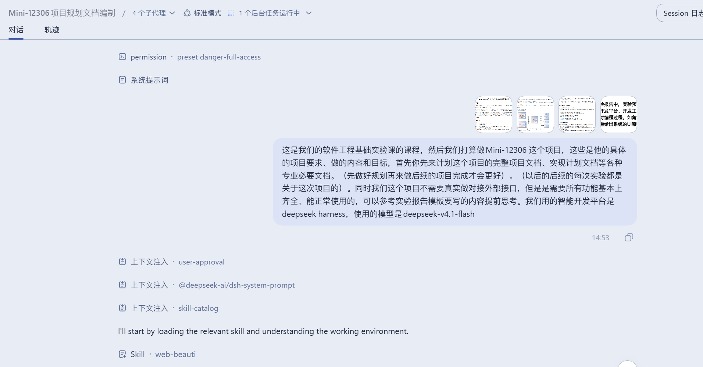
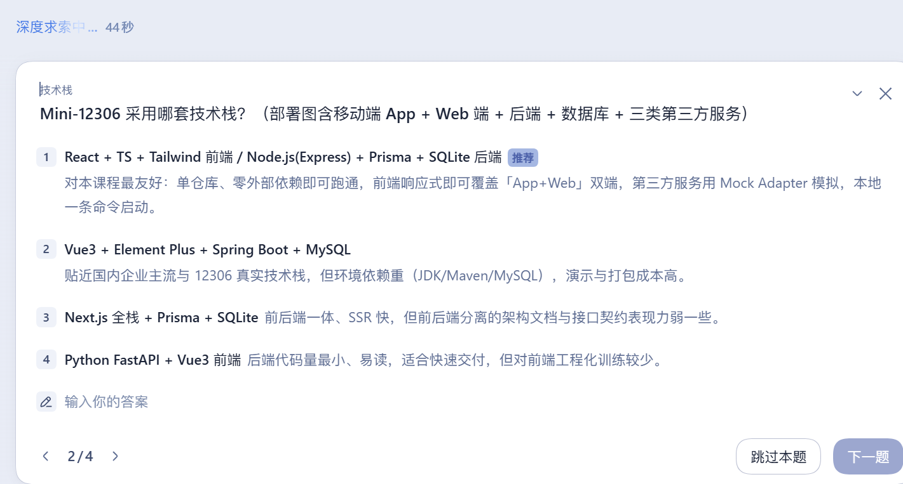
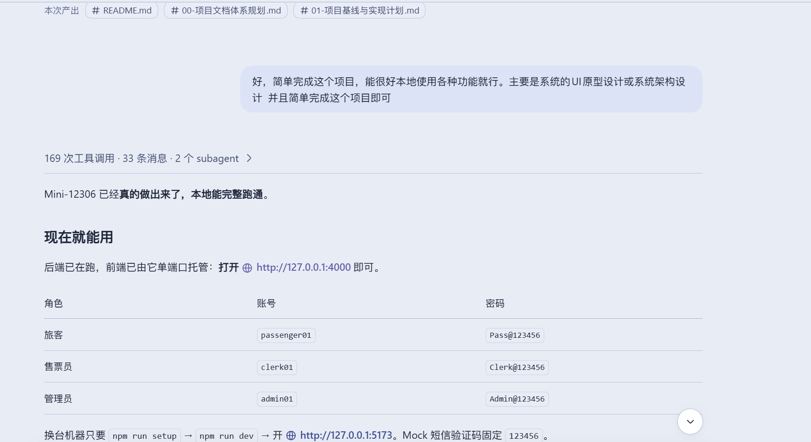
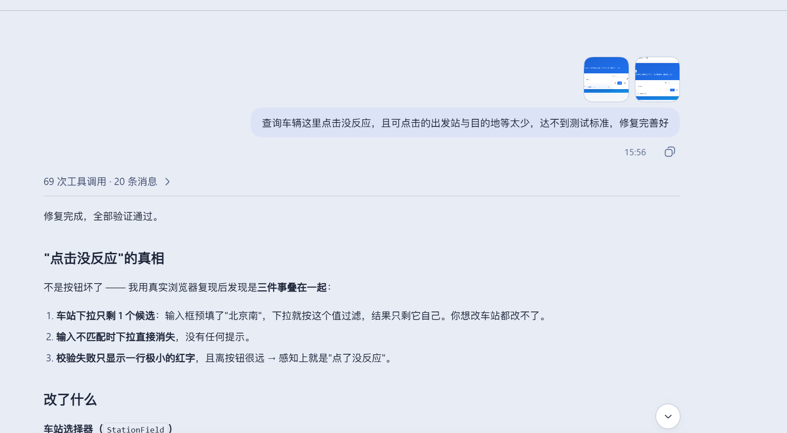

# 本组成员与 LLM 交互过程记录

> **所属实验**：软件工程基础实验 · 实验一（项目选题与结对编程）
> **项目**：Mini-12306 在线车票服务系统
> **智能开发平台**：DeepSeek Harness（DSH）
> **主力 LLM**：deepseek-v4.1-flash　**辅助 LLM**：deepseek-v4.1-flash-vision-exp（读图/审阅截图）
> **参与成员**：【待填姓名】、【待填姓名】
> **交互日期**：【待填：YYYY-MM-DD】
> **配套截图**：见 `截图/LLM交互-占位-01.png` ~ `LLM交互-占位-05.png`（请替换为本组真实会话截图）

---

## 1. 交互方式

本次实验采用**会话式交互**：由成员提出目标与约束，LLM 先澄清关键信息，再产出方案与文档；成员对产出逐项核校后才采纳。

| 交互形式 | 说明 |
| --- | --- |
| 需求描述 | 成员把课程要求（含需求原文截图）与项目目标作为提示词输入 |
| 澄清提问 | LLM 就"会影响整体方案"的决策点反问，而不是直接假设 |
| 文档产出 | LLM 生成文档草稿，成员核校编号、术语与事实 |
| 代码产出 | LLM 生成骨架与实现，**成员必须逐行读懂后才提交** |
| 实测验证 | 由脚本在真实环境跑回归，用数据而不是"看起来对"来判定通过 |

---

## 2. 关键交互节点

| 序号 | 成员输入（提示词要点） | LLM 响应 | 人工判断 |
| :--: | --- | --- | --- |
| 1 | 附上 4 张课程要求截图，说明要做 Mini-12306，要求"先做完整项目文档、实现计划等专业必要文档"，并声明智能开发平台为 DeepSeek Harness、模型为 deepseek-v4.1-flash | 先加载网页美化技能与工作环境侦察；读取课程下发的 `.doc` 报告模板（转成可编辑文本）；确认本机工具链 | 确认模板结构（预习 / 过程记录 / 结果与讨论 + 成绩评定表） |
| 2 | （反问环节）LLM 提出 4 个"会返工"的决策点 | 询问：分组规模？技术栈？本轮交付到什么程度？报告要 Word 还是 Markdown？ | 本组答复：**2 人组**；**React+TS+Tailwind / Express+Prisma+SQLite**；**要全部核心文档正文**；**Markdown + 可一键导出 docx** |
| 3 | "先停下子代理，重新来。弄简单、不需要多全面" | 立即停止 2 个正在运行的子代理，删除过度设计的产出，改为精简版：文档体系规划 + 项目基线与实现计划 | **成员叫停是本次交互最关键的决策**：避免了为一次性作业投入过多成本 |
| 4 | "简单完成这个项目，能很好本地使用各种功能就行。主要是系统的 UI 原型设计或系统架构设计" | 明确交付重心，开始实现完整可运行系统（后端 16 张表 / 68 个接口 / Mock 三方服务；前端 22 个页面） | 确认"可本地跑通"是硬指标，不是只交文档 |
| 5 | 反馈"查询这里点击没反应、可点击的车站太少" | 用无头浏览器复现并定位出 3 个叠加问题（下拉只 1 个候选 / 无匹配时静默消失 / 校验提示过弱），并扩展线路数据到 26 条 104 个车次 | 成员提供现象，LLM 负责定位根因；修复后由成员在浏览器验收 |
| 6 | 反馈"各个界面过于单调，可以搜网上的图片资料丰富页面" | 检索设计参考；因图片站反爬无法取稳定直链，改为**本地自绘 SVG**（铁轨透视 / 复兴号剪影 / 速度线 / 站牌角标 / 票根卡片 / 24 个图标） | 采纳"本地自绘"方案：离线可用、无版权风险、可随代码版本管理 |

---

## 3. 输入提示词示例（节选）

**第 1 轮（项目起步）**

> 这是我们的软件工程基础实验课的课程，然后我们打算做 Mini-12306 这个项目，这些是他的具体的项目要求、做的内容和目标，首先你先来计划这个项目的完整项目文档、实现计划文档等各种专业必要文档。（先做好规划再来做后续的项目完成才会更好）。（以后的后续的每次实验都是关于这次项目的）。同时我们这个项目不需要真实做对接外部接口，但是是需要所有功能基本上齐全、能正常使用的，可以参考实验报告模板要写的内容提前思考。我们用的智能开发平台是 deepseek harness，使用的模型是 deepseek-v4.1-flash

**第 2 轮（纠偏）**

> 先停下子代理，重新来。弄简单、不需要多全面，并且这一步简单完成即可，后续还有很多这个的实验的，不需要做多完善

**第 3 轮（确定交付重心）**

> 好，简单完成这个项目，能很好本地使用各种功能就行。主要是系统的 UI 原型设计或系统架构设计　并且简单完成这个项目即可

---

## 4. LLM 产出的可核验成果

| 类别 | 成果 | 核验方式 |
| --- | --- | --- |
| 文档 | 文档体系规划、项目基线与实现计划、系统架构设计说明书、数据库设计说明书、UI 原型与设计说明（合计 1075 行） | 逐份核校编号、术语、表名与接口路径的一致性 |
| 代码 | 后端 28 文件 / 7468 行，前端 33 文件 / 10131 行 | 类型检查 0 错误 + 生产构建通过 |
| 数据 | 16 张表、68 个接口、16 座车站 / 26 条线路 / 104 个车次 / 1456 个运行日 | 打开数据库与实际查询比对 |
| 测试 | 后端端到端 79 项断言、真实浏览器 UI 21 项断言、接口一致性 74 处调用核对 | **由脚本实测，全部通过** |

---

## 5. LLM 使用规范与红线（本组约定）

1. **AI 生成的代码必须逐行看懂才允许提交**，看不懂就问、就改，不允许"能跑就行"。
2. **核心算法必须人工推导并写测试**：余票扣减、退票费阶梯、改签差价、并发防超卖，均不直接采信生成结果。
3. **实验报告与文档如实标注 AI 使用情况**（即本文件）。
4. **不向模型投喂真实个人信息**：身份证号、手机号、银行卡一律使用虚构示例值。
5. **答辩时被问到的每一处实现都必须能自己讲清原理**，否则视为未完成。

---

## 6. 反思：本次交互中 LLM 的价值与局限

| 维度 | 表现 |
| --- | --- |
| **价值** | ① 快速把"截图里的模糊要求"整理成结构化的文档体系与里程碑；② 主动提出会返工的决策点（分组规模/技术栈/交付范围），避免后期推倒重来；③ 定位疑难缺陷时能构造真实浏览器复现环境，把"点了没反应"这种玄学问题定位到 `overflow: hidden` 造成的滚动容器语义；④ 一次性生成可运行的骨架，把人力集中在规则推导与验收上 |
| **局限** | ① 默认倾向于"做得更全"，第一轮就铺开 13 份文档与 12 个子代理，需要成员主动叫停；② 涉及外部资源（图片直链）时会被反爬挡住，需要及时切换到自绘方案；③ 生成的数值/规模描述需要人工核验（本次就发现过需求条数统计前后不一致，已修正） |
| **结论** | LLM 适合承担"起草、检索、复现、生成"，**不适合替人做取舍**。本次实验的关键转折（简化范围、确定重心、纠正设计）全部由成员做出，这也是我们理解的"人机协作"应有分工。 |

---

## 7. 附：交互截图

> **说明**：以下图片当前为**占位内容**。提交前请用本组真实的 DSH 会话截图覆盖 `截图/` 目录下的同名文件（`LLM交互-占位-0X.png`），无需改动本文件。

**图 A-1　提出项目需求与目标（含需求原文截图）**

{width=15cm}

**图 A-2　LLM 澄清问卷：分组规模 / 技术栈 / 交付范围 / 报告格式**

{width=15cm}

**图 A-3　文档体系规划与项目基线生成过程**

{width=15cm}

**图 A-4　系统架构设计与技术方案比选**

{width=15cm}

**图 A-5　依据实测反馈修订设计与实现**

{width=15cm}

| 编号 | 截图内容 | 文件 |
| :--: | --- | --- |
| 1 | 提出项目需求与目标（含需求原文截图） | `截图/LLM交互-占位-01.png` |
| 2 | LLM 澄清问卷：分组规模 / 技术栈 / 交付范围 / 报告格式 | `截图/LLM交互-占位-03.png` |
| 3 | 文档体系规划与项目基线生成过程 | `截图/LLM交互-占位-02.png` |
| 4 | 系统架构设计与技术方案比选 | `截图/LLM交互-占位-04.png` |
| 5 | 依据实测反馈修订设计与实现 | `截图/LLM交互-占位-05.png` |
