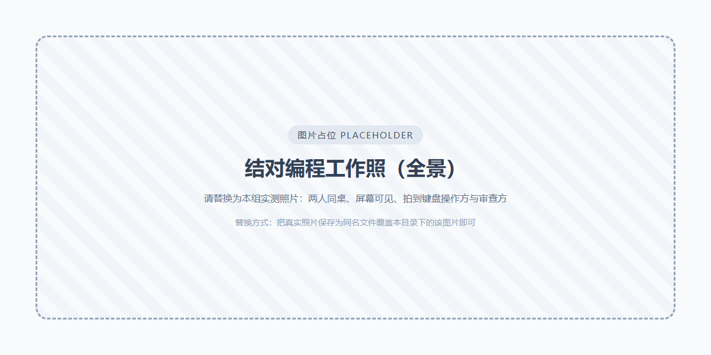
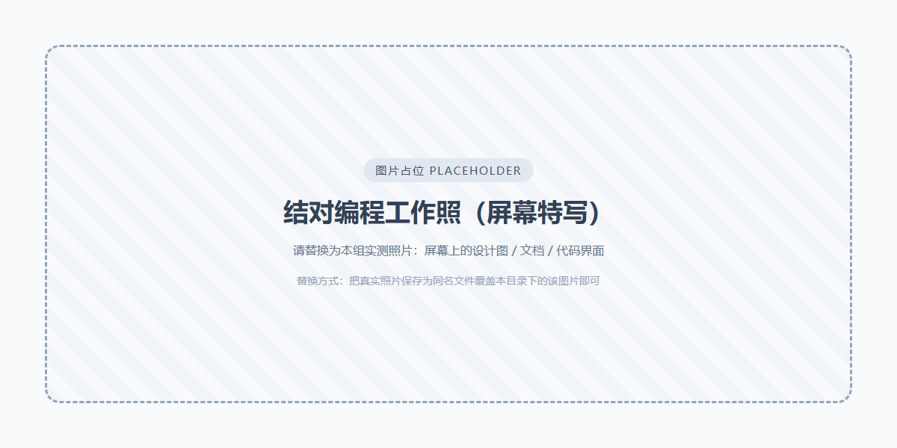
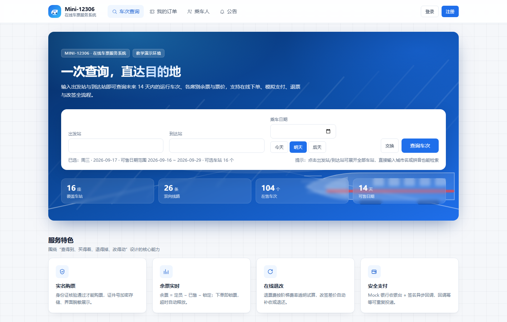
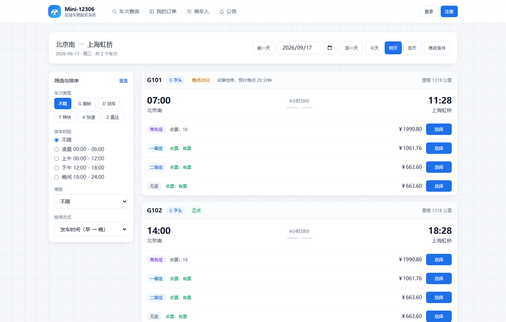
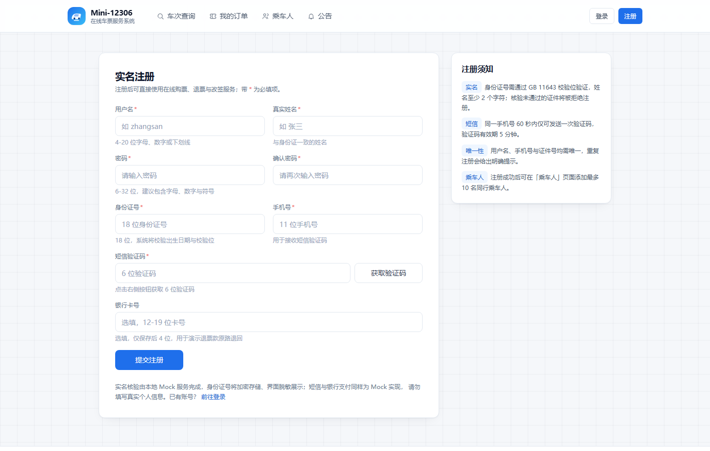
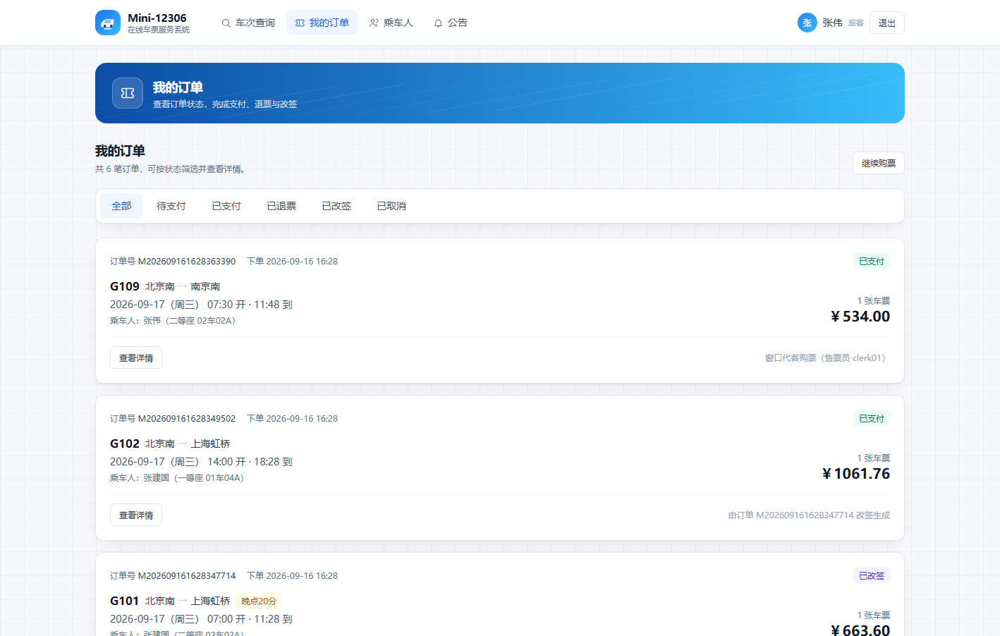
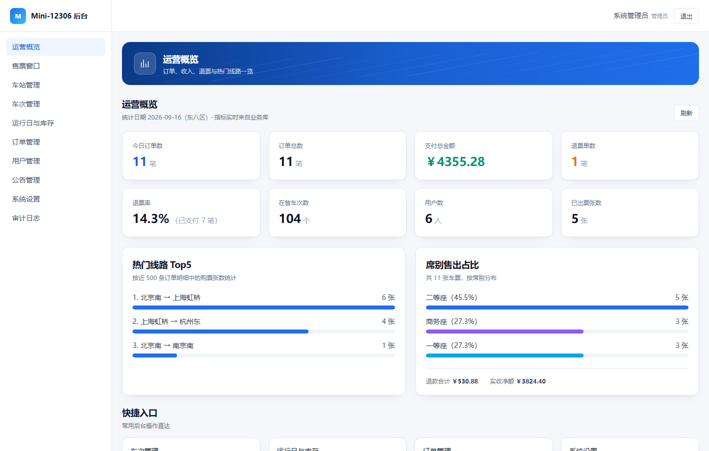
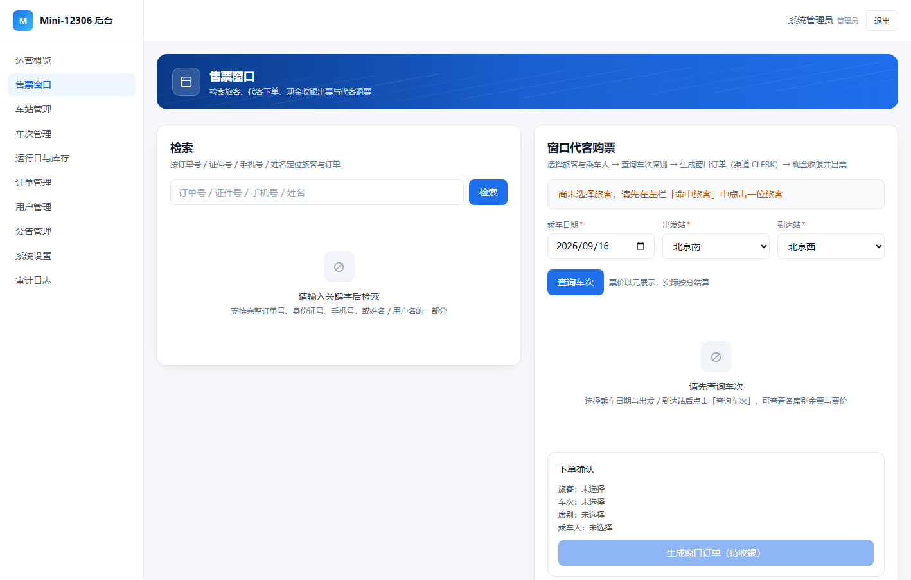

# 第一部分

## 一、实验目的

1. 掌握软件项目的选题方法，能够从真实业务痛点出发确定选题，并明确项目背景、目标与范围边界。
2. 掌握智能开发平台与 LLM 辅助开发的基本用法，建立"AI 生成、人工把关"的使用规范。
3. 掌握结对编程的组织方式，理解驾驶员与领航员的职责划分与角色互换机制。
4. 完成系统的前期设计表达，给出 UI 原型设计与系统架构设计，形成后续实验可复用的文档基线。

## 二、实验意义

选题是软件工程的第一决策，选题不清、范围不定会导致后续需求、设计与编码反复返工。结对编程让设计与代码在产出的同时就被第二双眼睛审查，能有效降低缺陷率。本课程共 6 次实验围绕同一项目递进，因此本次确定的技术方案与设计基线将在后续实验中反复复用。

## 三、实验基本原理与方法

本实验依据软件生命周期理论，把项目划分为立项、需求、概要设计、详细设计、编码实现、测试验收六个阶段，分别对应六次实验。在组织方式上采用结对编程：两人结对、全程在岗，一人任驾驶员负责实际产出，另一人任领航员负责审查思路与把控质量，并定时互换角色。在设计表达上采用原型驱动的方法，先用 UML 视图表达系统架构，再用可点击的 UI 原型表达用户交互，为后续编码提供明确依据。

## 四、项目选题及背景简介

**选题**：Mini-12306——简化版中国铁路 12306 在线车票服务系统。

**背景**：旅客乘坐火车出行需要购买车票，某些情况下还需要改签和退票。一般地，旅客需要到火车站的售票厅查询车次，并通过售票窗口购票、退票和改签。这种服务模式对旅客非常不友好，不仅耽误大量排队时间，也无法快速应对旅行中的突发情况；对铁路服务公司而言，现行模式落后，服务质量难以满足日益增长的旅客需求。当前主要存在两个问题：一是购票、改签和退票难，必须到售票厅排队办理，费时费力、效率低下；二是无法及时获取车次及其变动信息，车次与车票变动只能到售票厅或电话查询，实时性差、反馈慢。

为此，需要开发一个基于互联网平台的在线车票服务系统，借助软件技术与互联网技术，集成第三方身份证认证、移动服务、银行在线服务等能力，让旅客在线完成车次查询、购票、退票与改签。

**目标与范围**：本项目的目标是交付一个功能完整、可本地运行的在线车票服务系统，覆盖"查票—下单—支付—退票/改签"的完整闭环，并面向旅客、售票员、管理员三类角色提供差异化能力。考虑到实验环境无法申请真实的第三方资质，且 2 人组在 8 周内还需完成文档与测试工作，项目范围界定为：不做真实第三方接口对接（实名认证、短信、银行支付一律用本地 Mock 服务实现，但接口契约与真实服务保持同构、可通过配置切换），不采用微服务与消息队列，不做原生 App 打包（移动端以响应式网页承载），不做候补购票、联程换乘等扩展功能。

## 五、拟使用的智能开发平台、开发工具及 LLM

本次实验使用 **DeepSeek Harness（DSH）** 作为智能开发平台，主力模型为 **deepseek-v4.1-flash**，并辅以 deepseek-v4.1-flash-vision-exp 用于阅读需求截图与审阅界面截图。使用方式为会话式交互，配合澄清提问与技能加载，主要承担需求资料梳理、方案比选、文档起草、架构与原型设计表达、代码骨架生成以及缺陷定位等工作。

开发工具方面：使用 VS Code 编码调试，Node.js 作为后端运行环境，npm 管理依赖，Git 做版本控制，Vite 完成前端构建，Prisma 与 SQLite 负责数据建模与存储，Apifox 做接口自测，Chrome DevTools 做前端调试，Markdown 与 Mermaid 编写文档与图形，并自研 Node 脚本完成自动化回归测试。

需要特别说明的是，本组约定 AI 生成的内容必须经人工核验后才采纳：生成代码须逐行读懂，核心算法（余票扣减、退票费、改签差价、并发防护）必须人工推导并编写测试，报告中如实标注 AI 使用情况。

## 六、主要仪器设备及耗材

计算机 2 台（Windows 10/11，内存 8 GB 及以上），安装 Node.js 20 及以上、npm 10 及以上与 Git；数据库使用 SQLite 单文件，无需独立安装。第三方服务由本地 Mock 提供，不产生任何费用。

## 七、实验方案与技术路线

总体路线为：选题立项 → 需求梳理 → 技术选型 → 建立文档体系与项目基线 → 系统架构设计 → UI 原型设计 → 编码实现 → 测试与验收。

前端选用 React 18 + TypeScript + Vite + Tailwind CSS，后端选用 Node.js + Express + TypeScript，数据访问使用 Prisma，数据库使用 SQLite。这样可以前后端同语言，降低 2 人组的上下文切换成本；SQLite 零安装、单文件，便于演示与随项目提交。按 8 周 7 个阶段推进，本次实验（P0 立项）的交付物是选题与可行性结论、项目基线、文档体系规划、系统架构设计与 UI 原型。

本次实验要求给出系统的 UI 原型设计或系统架构设计，本组决定两者都做：架构设计说明"系统如何组成与部署"，UI 原型设计说明"用户如何使用系统"，两者互为补充。

# 第二部分

## 一、结对编程过程

### （一）结对编程机制

本组采用全员结对方式，不采用"各做一半"的平行开发，所有设计与文档任务均由两人同时在岗完成。驾驶员负责操作键盘、产出实际内容（写文档、画图、写代码）；领航员不操作键盘，负责审查思路、查资料、记录问题、提示卡点并核对质量。两人每 25～45 分钟互换一次角色，每次实验至少互换三次。

### （二）角色互换时间点与任务分工

实验时间：【待填：YYYY 年 MM 月 DD 日】14:00 — 17:00，共 3 学时。本次实验共完成 3 次角色互换，两人全程在岗，无单独作业时段。

| 时间节点 | 主要任务 | 驾驶员 | 领航员 |
| --- | --- | --- | --- |
| 14:00 — 14:45 | 选题讨论：确定 Mini-12306 选题，梳理需求背景与两个核心痛点，界定项目范围 | 成员甲 | 成员乙 |
| 14:45 — 15:00 | 【角色互换 ①】阶段小结：互评上一阶段产出，明确遗留问题 | 成员乙 | 成员甲 |
| 15:00 — 15:45 | 技术选型与项目基线：对比技术栈方案，确定选型，撰写项目基线与实现计划 | 成员乙 | 成员甲 |
| 15:45 — 16:00 | 阶段评审：核对文档之间的编号与术语一致性 | 双方 | 双方 |
| 16:00 — 16:15 | 【角色互换 ②】明确架构设计要点与图形表达方式 | 成员甲 | 成员乙 |
| 16:15 — 16:50 | 系统架构设计：绘制部署图、分层架构、模块划分与关键技术机制 | 成员甲 | 成员乙 |
| 16:50 — 17:00 | 【角色互换 ③】收尾：UI 原型走查、截图归档、提交文档 | 成员乙 | 成员甲 |

任务分工方面，成员甲主责技术选型与论证、项目基线与文档体系、系统架构设计以及配置管理；成员乙主责可行性分析、UI 原型设计与截图归档、报告撰写。结对编程要求两人全程参与，上述"主责"仅指该工作项的主要负责人。

### （三）工作照片

{width=13cm}

{width=13cm}

## 二、系统分析与设计

### （一）系统架构设计

需求原文给出的部署图包含移动端、Web 端、业务处理服务器、数据库系统四类节点，以及身份证认证、银行和支付系统、手机运营服务系统三类第三方服务。本组在保持语义一致的前提下做了落地映射：移动端以响应式网页（≤768px 断点）承载并配底部导航；Web 端为桌面视图（≥1024px），售票窗口与管理后台仅在桌面端开放；业务处理服务器为 Node.js + Express 应用，监听 4000 端口；数据库采用 SQLite 单文件，通过 Prisma 访问；三类第三方服务分别由本地 Mock 服务实现，其中 Mock 银行提供收银台页面，并在支付完成后向本系统发送带 HMAC-SHA256 签名的异步回调，完整走通"创建支付单—收银台支付—异步回调—验签—结算出票"的链路。

系统采用分层架构，自上而下为表现层（页面与组件）、接口层（路由、鉴权、参数校验、统一响应）、业务服务层（库存、票价、退改规则、订单视图、审计）、第三方适配层（统一接口 + Mock 实现）与数据层。业务功能划分为八个模块：用户与认证、实名认证、车次查询、订单与购票、支付、退票与改签、系统设置与运营、基础服务适配。

设计中有三处关键机制值得说明。第一，防超卖：余票按"总定员 − 已售 − 已锁定"计算，下单时在数据库事务内先判断余票是否充足，再用带版本号的条件更新扣减库存，版本号未变才允许写入，受影响行数为零即视为并发冲突。第二，第三方适配层：定义实名认证、短信、支付三个统一接口，业务代码只依赖接口不感知实现，通过配置项即可切换到真实服务。第三，城市级车次检索：解析优先级为站名精确、电报码、城市名、模糊匹配，当输入城市名或站名与城市名相同时，自动展开为该城市的全部车站再检索，与真实 12306 的"按城市查车"体验一致。

### （二）UI 原型设计

UI 原型围绕"查票—下单—支付—退改"主流程设计，目标是主流程一屏可见、关键状态一眼可辨。视觉上采用铁路蓝为主色、中国红为强调色，并用铁轨透视、复兴号剪影、站牌角标、车票票根缺口等铁路元素作为设计母题；这些元素全部由本地自绘 SVG 实现，不依赖任何外部图片，保证离线可用且无版权风险。正文对比度不低于 4.5:1，表单均带标签，键盘可完整操作。

共设计 21 个页面。旅客端 11 个：首页（车次查询）、车次列表、确认订单、支付、我的订单、订单详情、改签、乘车人管理、个人中心、公告、登录与注册；售票窗口 1 个：代客检索与购票、现金收银出票；管理后台 9 个：运营概览、车站管理、车次管理、运行日与库存、订单管理、用户管理、公告管理、系统设置、审计日志。

原型不是静态图片，而是可直接运行、可点击的完整系统：执行 npm run setup 完成依赖安装、建库与演示数据灌入，再执行 npm run dev 启动前后端，浏览器访问 http://127.0.0.1:5173 即可操作。演示账号为旅客 passenger01、售票员 clerk01、管理员 admin01。

## 三、实验过程发现的问题及解决

1. **首页"查询车次"点击后无反应。** 用真实浏览器复现后确认按钮跳转本身正常，但发现车站下拉只显示 1 个候选（输入框预填了站名，下拉按该值过滤后只剩它自己），且校验失败只有一行很小的红字。解决方法是：车站下拉改为聚焦时展示全部车站，区分"浏览"与"检索"两种状态；校验失败改为三重反馈（卡片内告警 + 右上角提示 + 自动聚焦出错字段）；输入不匹配时给出"查看全部车站"入口。

2. **输入"北京 → 上海"查不到任何车次。** 抓取接口返回后发现"北京"被解析成了北京南站，而北京南只开往上海虹桥。解决方法是实现城市级检索，城市名自动展开为该城市的全部车站后再检索，并修正站名、电报码、城市名的解析优先级。

3. **给首页视觉区加背景装饰后按钮再次点不动，且控制台无任何报错。** 在浏览器里测量按钮位置，发现点击前后位置相差 54 像素。根因是 overflow:hidden 使容器变成了可滚动容器，scrollIntoView 在其内部滚动，导致按下与抬起落在不同元素上，click 事件不触发。改用 overflow:clip 后问题消失，并在自动化测试中加入位移检测防止复发。

4. **在线重置数据时报文件占用错误，数据库被清空但数据没有灌入。** 复现后发现是 Windows 文件锁导致，解决方法是把数据库客户端生成命令从重置脚本中剥离为独立命令，使重置可在服务运行时安全执行。

## 四、本组成员与 LLM 交互过程

本组使用 DeepSeek Harness 平台与 deepseek-v4.1-flash 模型完成本次实验，交互过程截图如下（当前为占位图片，提交前替换为本组真实会话截图）。完整的交互文字记录见同目录下的独立文件《LLM交互记录》。

{width=14cm}

{width=14cm}

{width=14cm}

# 第三部分

## 一、实验结果

本次实验完成了可运行的 UI 原型，共 21 个页面，以下为 6 张关键页面截图。

{width=15cm}

{width=15cm}

{width=15cm}

{width=15cm}

{width=15cm}

{width=15cm}

## 二、结果与讨论

从选题看，Mini-12306 兼具业务真实性与实现可行性，痛点清晰、功能边界可界定，适合作为贯穿六次实验的课程项目。把范围收敛为"查询—下单—支付—退改"主闭环，并明确列出不做的事项，有效避免了范围蔓延。

从设计看，本次产出的项目基线、系统架构设计与 UI 原型在随后的实现中被直接作为依据使用，未发生因设计缺失导致的大规模返工；但也在测试阶段暴露出四个真实缺陷（见第二部分第三节），说明设计对边界情况的考虑仍不够充分，需要靠实测来补足。

从关键机制看，防超卖方案经实测有效：把某席别定员压到只剩 3 张后发起 8 个并发下单，结果恰好 3 笔成功、5 笔被拒绝，库存始终未超卖；退票费阶梯与改签差价规则也已实现并有测试覆盖。

从协作方式看，结对编程使文档与代码在产出时即被复核，本次实验未出现文档之间互相矛盾的情况；角色互换后接手一方必须读懂对方产物，客观上暴露了若干表述不清之处并促使统一术语。代价是"看键盘的时间"减半，短期产出速度低于分头作业，但对 2 人组而言，省去的返工与沟通成本更具价值。

## 三、结论与不足

本次实验完成了选题立项、技术选型、文档体系规划、系统架构设计与 UI 原型设计，产出的基线可以直接支撑后续五次实验，达到了预期目标。同时也要看到，LLM 虽然显著提升了资料梳理、文档起草与代码骨架生成的效率，但它默认倾向于"做得更全"，需要由人主动收敛范围；本次实验中范围简化、交付重心确定与设计纠偏等关键决策均由本组成员做出。

存在的不足是：需求规格说明书与需求分析模型尚未产出（将在实验二完成），接口文档尚未独立成文（将在实验三、四完成），单元测试尚未系统化（将在实验六补齐，核心算法覆盖率目标不低于 80%）。
